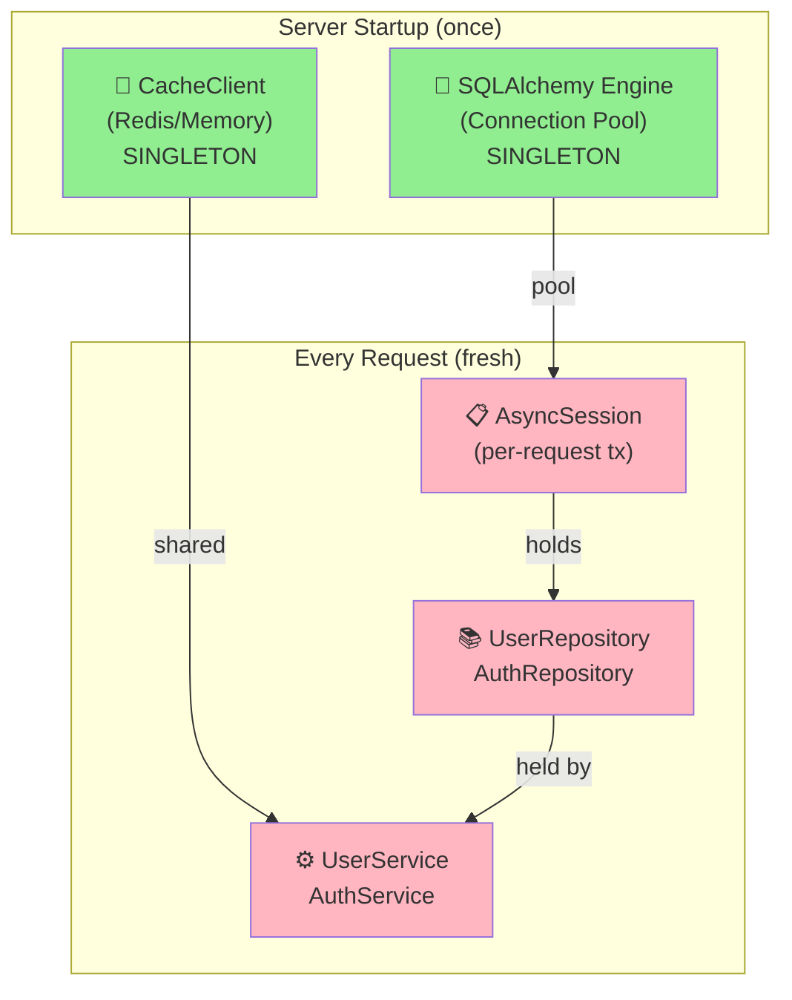
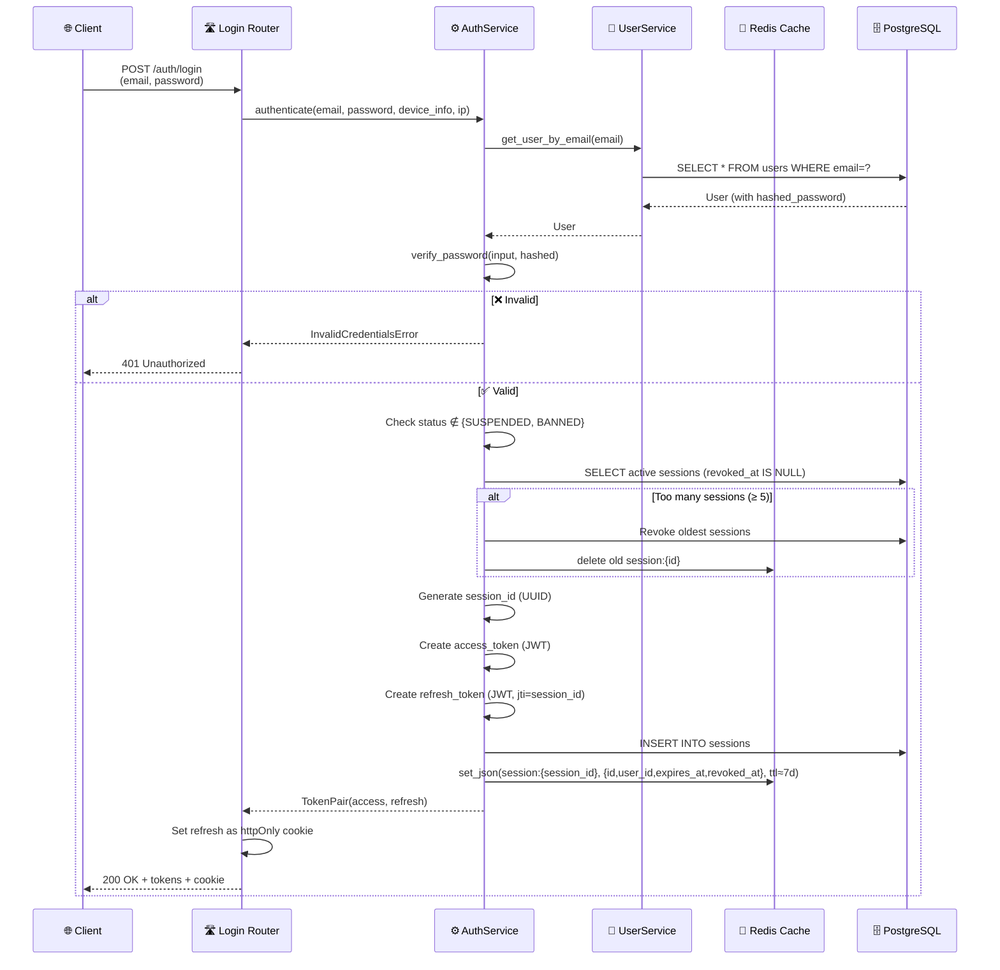
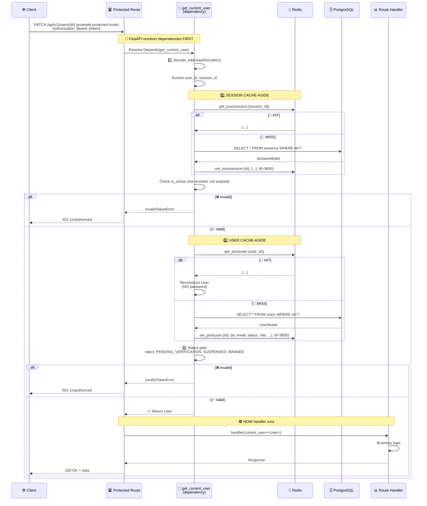
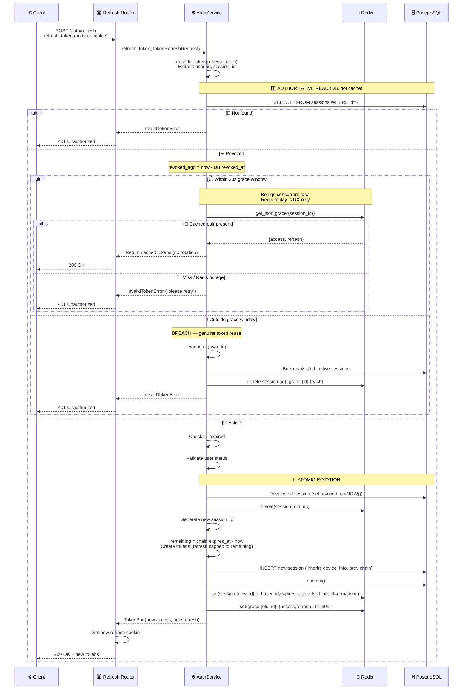
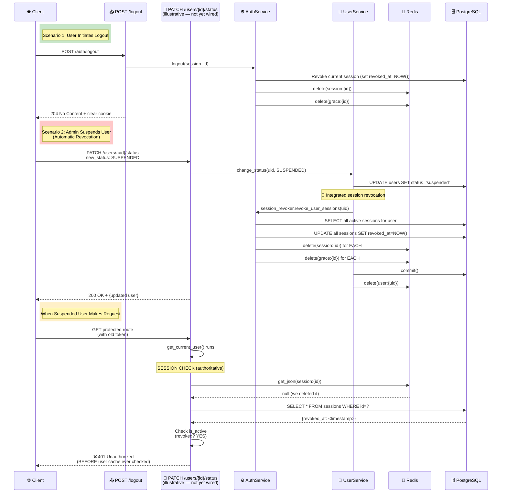
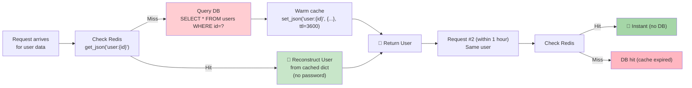
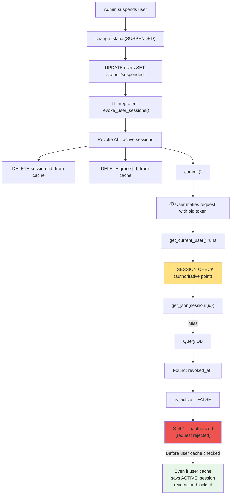
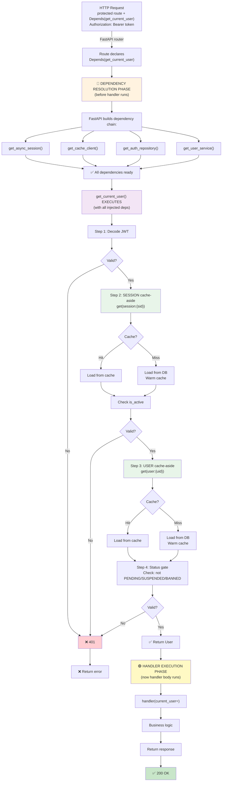
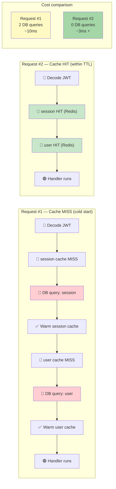
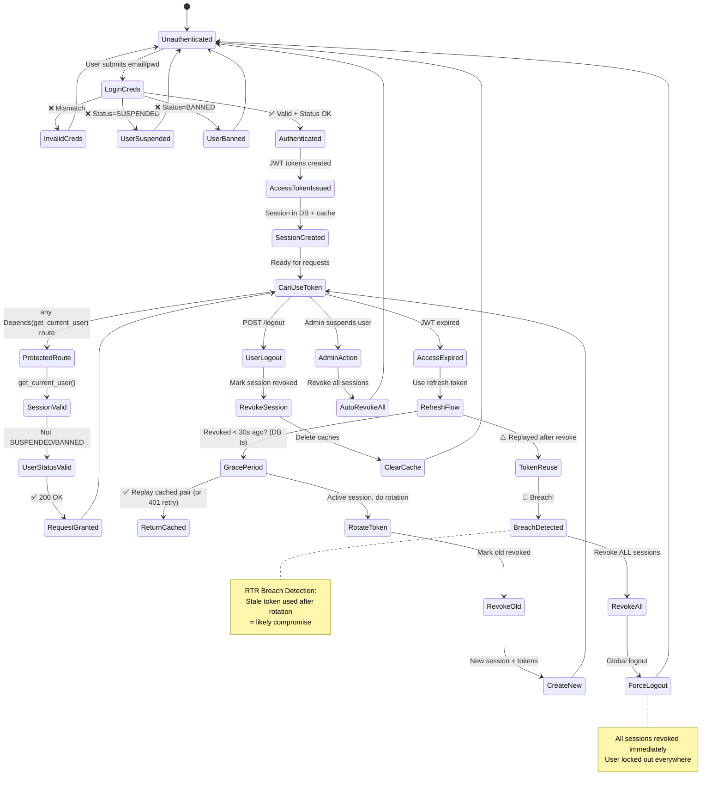

# Request Lifecycle, Dependency Injection & Caching — Complete Flow

This document explains the **complete end-to-end authentication and caching flow** in AsyncPulse.

Topics covered:

- **DI Lifecycle**: Why services are per-request, not singletons
- **Authentication Flow**: Login → Token Usage → Logout
- **Cache-Aside Pattern**: How data persists across requests
- **Session Revocation**: How status changes immediately lock users out
- **Refresh Token Rotation**: Grace periods, breach detection, atomic rotation

> ### ⚠️ Note on example endpoints
>
> Some routes used in the diagrams below are **illustrative**, not yet implemented:
>
> | Endpoint in diagrams                                                    | Status                                                                                       |
> | ----------------------------------------------------------------------- | -------------------------------------------------------------------------------------------- |
> | `POST /auth/login`, `/auth/refresh`, `/auth/logout`, `/auth/logout-all` | ✅ Real                                                                                      |
> | `PATCH /users/{id}` (update), `DELETE /users/{id}` (superuser)          | ✅ Real, runs `get_current_user`                                                             |
> | `GET /users/`, `GET /users/{id}`                                        | ✅ Real, but currently **public** (no `get_current_user`)                                    |
> | `GET /users/me`                                                         | ❌ **Not implemented** — used as a representative "protected read" example                   |
> | `PATCH /users/{id}/status`                                              | ❌ **Not implemented** — `UserService.change_status` exists but isn't exposed as a route yet |
>
> The `get_current_user` flow shown applies to **any** route that declares
> `Depends(get_current_user)` (today: `PATCH`/`DELETE /users/{id}`, `POST /auth/logout-all`).
> Timing numbers in the performance section are illustrative, not measured.

---

## 1. Architecture Overview: Singletons vs Per-Request



**Key insight:** Services are created per-request because they wrap an `AsyncSession`, which is request-scoped (each request = one transaction). The expensive resources (Redis, DB connections) live in singleton pools underneath.

| Framework    | Service Lifetime | How It Stays Safe                             |
| ------------ | ---------------- | --------------------------------------------- |
| Spring Boot  | Singleton        | Thread-bound transaction via `@Transactional` |
| ASP.NET Core | Scoped (per-req) | `DbContext` is scoped                         |
| NestJS       | Singleton        | ALS ambient context (nestjs-cls)              |
| **FastAPI**  | **Per-request**  | Wrapper is per-request, resources in pools    |

---

## 2. Complete Authentication Flow: Login → Use → Logout

### 2.1 Login Flow: Credentials → Token Pair → Session Created



**What's created:**

- Session in DB: `id`, `user_id`, `device_info`, `ip_address`, `created_at`, `expires_at`, `previous_session_id`
- Tokens: access (~30 min), refresh (~7 days)
- Cache: `session:{id}` holds only the validation projection — `id`, `user_id`, `expires_at`, `revoked_at` (TTL = `REFRESH_TOKEN_EXPIRE_DAYS`, ~7 days at login). Forensic/UI metadata stays in the DB and off the hot path.

---

### 2.2 Using a Token: Protected Request with Cache-Aside



**Cache strategy:**

- `session:{sid}`: 1 hour (authoritative lockout point)
- `user:{uid}`: 1 hour (identity, status, role — safe because session revocation is the real gate)
- Password: **NOT cached** (only needed at login, only read from DB there)

---

### 2.3 Refresh Token Rotation (RTR) with Grace Period & Breach Detection



**RTR mechanics:**

- **Authoritative read**: Refresh reads the session row from the DB (not the cache). Rotation is a security-critical write that runs at most once per access-token lifetime, so the DB `revoked_at` is the source of truth.
- **Grace period**: 30-second window to handle benign concurrent retries, **gated on the DB `revoked_at` timestamp** — not on the presence of a Redis key. A Redis outage can therefore never trigger a false `logout_all`.
- **Redis replay**: Within the grace window, Redis is consulted only to return the identical new token pair to a losing concurrent caller. A miss is a safe `401` ("please retry"), never a breach.
- **Breach detection**: A revoked session replayed _outside_ the grace window → genuine reuse → `logout_all` (single atomic bulk revoke).

---

### 2.4 Logout & Automatic Revocation on Status Change



**Key invariant:** Session revocation is the **authoritative lockout point**. Even if user cache is stale, a revoked session blocks everything.

---

## 3. Cache-Aside Pattern Explained



**Two keys involved:**

| Key             | Created By               | Cleared By                                  | TTL                                                                                      | Purpose                            |
| --------------- | ------------------------ | ------------------------------------------- | ---------------------------------------------------------------------------------------- | ---------------------------------- |
| `session:{sid}` | login, refresh           | logout, logout_all, revocation, suspend/ban | ~7d at login; `remaining_ttl` on refresh; **3600s** when re-warmed by `get_current_user` | Session state & lockout            |
| `user:{uid}`    | get_current_user on miss | update_user, change_status, delete_user     | 1 hour                                                                                   | Identity (id, email, status, role) |

**Why no password hash in cache?** Only needed at login (read straight from DB). Caching it increases Redis exposure with zero benefit.

---

## 4. Why Caching Identity Is Secure

Even though `user:{id}` can be stale for up to 1 hour, it cannot keep a revoked user authenticated:



**Why this works:**

1. Session revocation is **immediate** (same transaction as status change)
2. Session cache is **deleted**
3. Session is checked **before** user status
4. Stale user cache cannot override revoked session

---

## 5. Request Lifecycle Diagram (Dependency Resolution → Handler)



---

## 6. Performance: Cache Hits Save DB Queries



|                | Request #1 (cold)     | Request #2+ (warm) |
| -------------- | --------------------- | ------------------ |
| Session lookup | DB query + warm cache | Redis hit only     |
| User lookup    | DB query + warm cache | Redis hit only     |
| DB queries     | 2                     | 0                  |
| Relative speed | baseline              | ~3x faster         |

> Numbers are illustrative. Actual latency depends on Redis/DB network conditions.

---

## 7. State Machine: Complete Authentication States



---

## 8. Key Invariants & Safety Properties

### Invariant 1: Session Revocation is Authoritative

- Even if user cache is stale, a revoked session blocks access
- Revocation is immediate (same transaction as status change)
- Cache is deleted to ensure DB is read on next attempt

### Invariant 2: Password Never Cached

- Password hash only needed at login
- Never read in authenticated request path
- Reduces Redis exposure surface

### Invariant 3: Grace Period Prevents Storms

- 30-second window for benign concurrent retry detection, gated on the DB `revoked_at` timestamp
- Redis is a UX optimization only; a miss yields a safe 401, never a false breach
- Prevents rotation loops from network retries

### Invariant 4: Per-Request Services Are Safe

- Services hold no request-scoped state
- Shared resources (Redis, DB pool) are singletons
- Service instantiation cost is negligible

---

## 9. Known wrinkle / future cleanup

The cache-aside **mechanics** for the user currently live inline inside
`get_current_user` (`modules/auth/authentication.py`). That's business/data-access
logic in the wrong layer. The cleaner design is to move it into `UserService`:

```python
# users/service.py  (proposed)
async def get_user_by_id_cached(self, user_id: str) -> User | None:
    """Fetch a user by ID with cache-aside."""
    ...
```

Then `get_current_user` stays a thin guard:

```python
user = await user_service.get_user_by_id_cached(user_id)
```

The call site does not change — `get_current_user` is still the per-request entry
point routes inject. Only the responsibility for the cache read/write moves down
into the service layer where data access belongs.

---

## TL;DR — Quick Reference

| Component             | Lifetime    | When Created          | When Destroyed                                                                 |
| --------------------- | ----------- | --------------------- | ------------------------------------------------------------------------------ |
| `CacheClient`         | Singleton   | Server startup        | Server shutdown                                                                |
| `SQLAlchemy Engine`   | Singleton   | Server startup        | Server shutdown                                                                |
| `AsyncSession`        | Per-request | Request start         | Request end                                                                    |
| `UserService`         | Per-request | Dependency resolution | Request end                                                                    |
| `session:{sid}` cache | TTL         | Login/refresh         | Logout/revoke; else ~7d (login), `remaining_ttl` (refresh), or 3600s (re-warm) |
| `user:{uid}` cache    | TTL         | First access          | Invalidation or 1 hour                                                         |
| `grace:{sid}` cache   | TTL         | Rotation              | Grace timeout or 30s                                                           |

**Flow summary:**

1. Client sends request with token
2. FastAPI resolves dependencies (cheap, no I/O)
3. `get_current_user` runs: decode token → session check (cache-aside) → user check (cache-aside) → status gate
4. Handler runs with validated `User`
5. Response sent
6. Service instance garbage-collected, caches remain in Redis
7. Next request reuses warm caches (fast, no DB)
