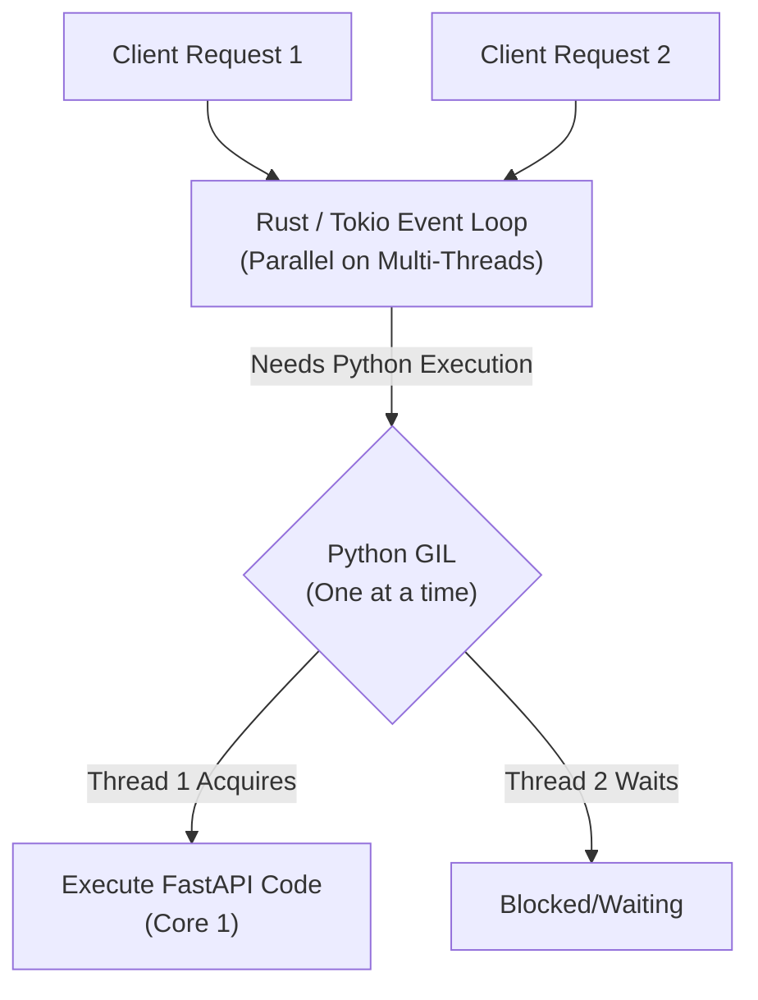

# Python ASGI Concurrency & Web Servers: Uvicorn vs. Granian

This document summarizes the system architecture, concurrency models, and performance characteristics of modern Python ASGI servers (specifically **Uvicorn** and **Granian**), along with how they interact with Python's Global Interpreter Lock (GIL).

---

## 1. Core Concepts

### WSGI vs. ASGI

* **WSGI (Web Server Gateway Interface)**: The classic synchronous standard (Flask, Django). Operates on a thread-per-request model, making it unsuitable for persistent async connections like WebSockets or long polling.
* **ASGI (Asynchronous Server Gateway Interface)**: The modern async successor (FastAPI, Starlette). It enables asynchronous request handling, WebSockets, and HTTP/2.

### The Role of the Web Server

FastAPI is a *web framework* (handles routing, serialization, and validation). It does not listen on a network port directly. An *ASGI server* (like Uvicorn or Granian) sits in front of FastAPI, listens for incoming network connections, parses the raw HTTP packets, and passes them to the FastAPI application.

---

## 2. Uvicorn

**Uvicorn** is the standard, battle-tested ASGI server for the Python ecosystem.

* **Technology Stack**: Written in Python, but utilizes high-performance C-extensions when installed as `uvicorn[standard]`:
  * **`uvloop`**: A Cython-based drop-in replacement for Python's standard `asyncio` event loop, built on top of `libuv` (the same library powering Node.js's I/O).
  * **`httptools`**: A Cython wrapper around Node.js's high-performance C-based HTTP parser (`llhttp`).
* **Execution Model**: Single-threaded and event-loop driven. A single Uvicorn process runs on a single CPU core.
* **Scaling**: To utilize multiple CPU cores, Uvicorn must be run in multi-process mode using a process manager like **Gunicorn** or by using the `--workers` flag.

---

## 3. Granian

**Granian** is a modern, ultra-high-performance web server for Python applications.

* **Technology Stack**: Written in **Rust**, built on top of:
  * **`hyper`**: A fast, correct, and memory-safe HTTP library written in Rust.
  * **`tokio`**: A multi-threaded asynchronous runtime for Rust.
  * **`PyO3`**: High-performance Rust bindings for the Python interpreter, allowing zero-copy sharing of data between the Rust networking layer and Python.
* **Execution Model**: Multi-threaded internally. A single Granian process runs a multi-threaded Rust loop that manages all I/O, socket reads, and HTTP parsing.
* **Scaling**: While Granian handles I/O across multiple threads, it still must spawn multiple processes (`--workers`) to run Python code across multiple cores due to Python's GIL.

---

## 4. The Python GIL (Global Interpreter Lock) Bottleneck

The **GIL** is a mutual-exclusion lock in the standard CPython interpreter that ensures only one thread executes Python bytecode at a time.

### Why Multi-threading is Not Enough for Python

Even though Granian can handle thousands of TCP connections concurrently across multiple Rust threads, the moment it needs to run your FastAPI business logic (Python code), it must acquire the Python GIL.

### The Solution: Multi-Process Execution

To bypass the GIL and utilize all CPU cores, we must run multiple **Worker Processes**:

* **1 process = 1 Python interpreter instance = 1 GIL**.
* Running `workers = CPU_CORES` creates multiple independent Python interpreters, enabling true parallel Python execution across cores.

---

## 5. Architectural Comparison

| Metric / Feature | **Uvicorn** | **Granian** | **Node.js** |
| :--- | :--- | :--- | :--- |
| **Language** | Python / Cython | Rust | C++ / JavaScript |
| **Underlying Engine** | `uvloop` (libuv) | `tokio` & `hyper` | `libuv` & `v8` |
| **I/O Concurrency** | Single-threaded Loop | Multi-threaded Loop (Rust) | Single-threaded Loop |
| **Multi-Core Scaling** | Multi-process (`--workers`) | Multi-process (`--workers`) | Multi-process (`cluster` / PM2) |
| **Memory Efficiency** | Moderate | High | Moderate |
| **Typical Hello-World RPS** | ~15,000 RPS (2 cores) | ~30,000+ RPS (2 cores) | ~25,000 RPS (2 cores) |

---

## 6. Future: Python Subinterpreters (PEP 684)

Starting in **Python 3.12+**, support was added for **Per-Interpreter GILs**.
This feature will allow a single process to host multiple Python subinterpreters, each running on a separate thread with its own independent GIL. Once ASGI servers fully support this, we will be able to run high-performance, multi-core Python applications within a **single process**, eliminating the memory and startup overhead of spawning multiple OS processes.
