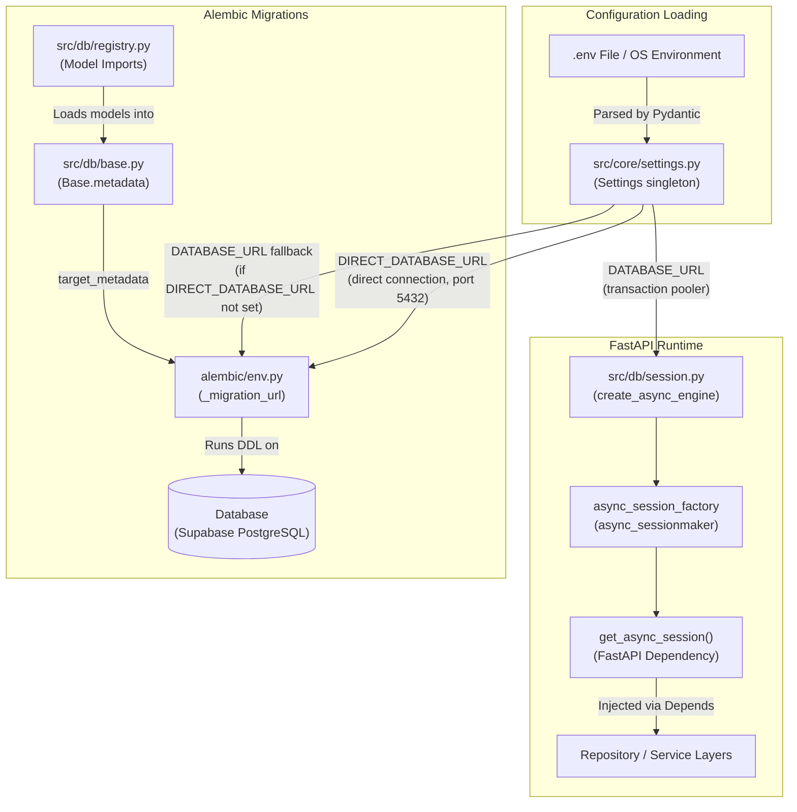

# Database Configuration & Initialization Flow

This document details how environment configurations, database engine setup,
and Alembic migrations are structured in the AsyncPulse codebase.

---

## Architecture Overview Diagram



---

## 1. Configuration Layer

### Settings Singleton

- **File:** `src/core/settings.py`
- **Responsibility:** Parses environment variables from `.env` or OS environment
  using Pydantic Settings. Exposes a cached singleton via `get_settings()`.
- **Key fields:**

| Field | Purpose |
|---|---|
| `DATABASE_URL` | Runtime app connection — transaction pooler (port 6543 on Supabase). asyncpg is configured with `statement_cache_size=0` for pgbouncer compatibility. |
| `DIRECT_DATABASE_URL` | Alembic migrations only — direct Postgres connection (port 5432). Optional; falls back to `DATABASE_URL` when not set. |
| `DB_SCHEMA` | Postgres schema name. Applied to `Base.metadata` and all Alembic operations. |
| `SECRET_KEY` | JWT signing key. No default — must be supplied. Validated for minimum 32-character length at startup. |

### Why two database URLs?

Supabase routes application traffic through **pgbouncer** in transaction-pooling
mode (port 6543). This is correct for the app — it keeps connection counts low
and asyncpg works fine with it.

However, pgbouncer's transaction mode **silently discards DDL** (`CREATE TABLE`,
`ALTER`, etc.). Running `alembic upgrade head` through the transaction pooler
appears to succeed (the `alembic_version` row is written) but the schema changes
never land.

Migrations must connect directly to the Postgres primary. That connection is
configured via `DIRECT_DATABASE_URL` (port 5432, same credentials). The app
never uses this URL — it is only read by `alembic/env.py`.

```
.env
├── DATABASE_URL  → port 6543  → app runtime (asyncpg + pgbouncer)
└── DIRECT_DATABASE_URL → port 5432  → alembic migrations only
```

---

## 2. Application Runtime (HTTP Layer)

### Database Session Lifecycle

- **File:** `src/db/session.py`
- **Responsibility:** Instantiates the SQLAlchemy connection pool and provides
  per-request session access.
- **Flow:**
  - **Engine:** Module-level `create_async_engine` using `settings.DATABASE_URL`
    with `statement_cache_size=0` and a scoped `search_path` for pgbouncer
    compatibility.
  - **Session Factory:** `async_sessionmaker` yields `AsyncSession` instances
    with `expire_on_commit=False`.
  - **FastAPI Dependency:** `get_async_session()` yields one session per HTTP
    request and closes it on completion.

### Startup — No `create_all`

The application lifespan (`src/core/lifespan.py`) does **not** call
`Base.metadata.create_all`. Schema is owned entirely by Alembic migrations.
The app assumes the database has already been migrated (`alembic upgrade head`)
before it starts. This keeps the migration history as the single source of truth
and prevents silent schema drift.

### Layered Dependency Injection

- **File:** `src/modules/users/dependencies.py` (representative example)
- **Responsibility:** Wires HTTP endpoints down to the service layer.
- **Flow:**
  1. `get_async_session` → `AsyncSession` (per request)
  2. `AsyncSession` → `UserRepository`, `UnitOfWork` (share the same session
     via FastAPI's per-request dependency cache)
  3. `UserRepository` + `UnitOfWork` → `UserService`
  4. `UserService` → injected into router endpoint via `Depends`

  A single session is consistently shared across all repositories within one
  request, so multi-repository writes are atomic through a single `UnitOfWork`.

---

## 3. Database Migrations (Alembic Layer)

### Schema Blueprint Base

- **File:** `src/db/base.py`
- **Responsibility:** Single `DeclarativeBase` that all ORM models subclass.
- **Detail:** Sets `schema=settings.DB_SCHEMA` on `Base.metadata` so every
  table is created in the correct Postgres schema without per-model repetition.

### Model Discovery Registry

- **File:** `src/db/registry.py`
- **Responsibility:** Ensures all models are registered on `Base.metadata`
  before Alembic inspects it.
- **Detail:** SQLAlchemy only tracks a model's table if that model's module has
  been imported. `registry.py` explicitly imports every model (`UserModel`,
  `SessionModel`, etc.) and exposes `target_metadata = Base.metadata` for
  Alembic to diff against the live schema.
- **Rule:** Every new model must be imported here, or Alembic will not detect it
  during `--autogenerate`.

### Migration Runner

- **File:** `alembic/env.py`
- **Responsibility:** Connects Alembic to the database and executes migrations.
- **Flow:**
  1. Loads the settings singleton.
  2. Calls `_migration_url()` — returns `DIRECT_DATABASE_URL` if set, otherwise
     falls back to `DATABASE_URL`. This is the URL the async engine uses for DDL.
  3. Imports `target_metadata` from `registry.py`.
  4. Builds an async engine with `NullPool` (no connection reuse between
     statements) and the pgbouncer-safe `connect_args`.
  5. Creates the schema if missing (`CREATE SCHEMA IF NOT EXISTS`).
  6. Runs migration scripts within a single transaction.

### Running Migrations

```bash
# Apply all pending migrations (uses DIRECT_DATABASE_URL automatically)
make migrate-up

# Generate a new migration after model changes
make migrate-gen m="feat: add notifications table"

# Check current revision
make migrate-current

# Rollback one step
make migrate-down
```
