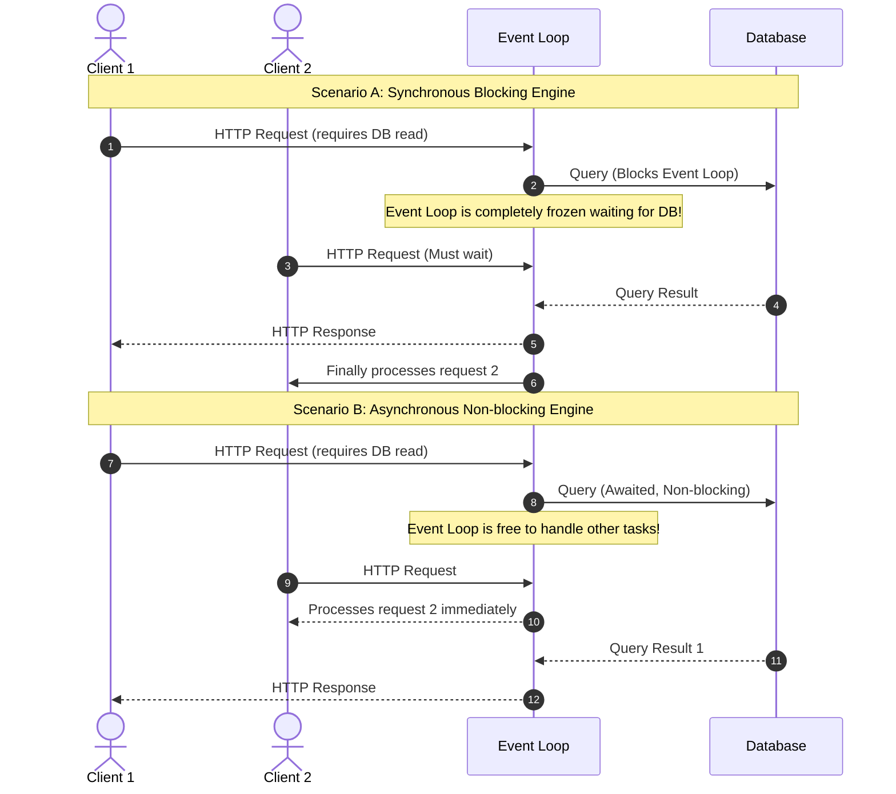
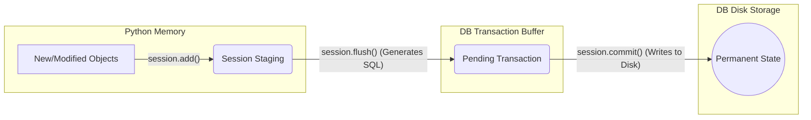
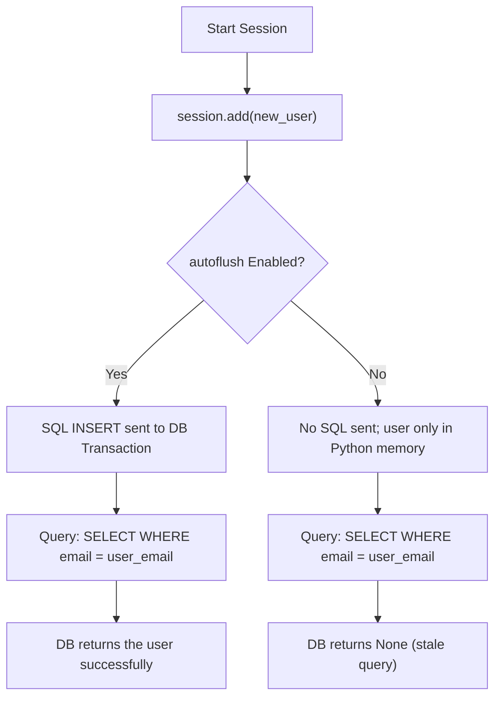
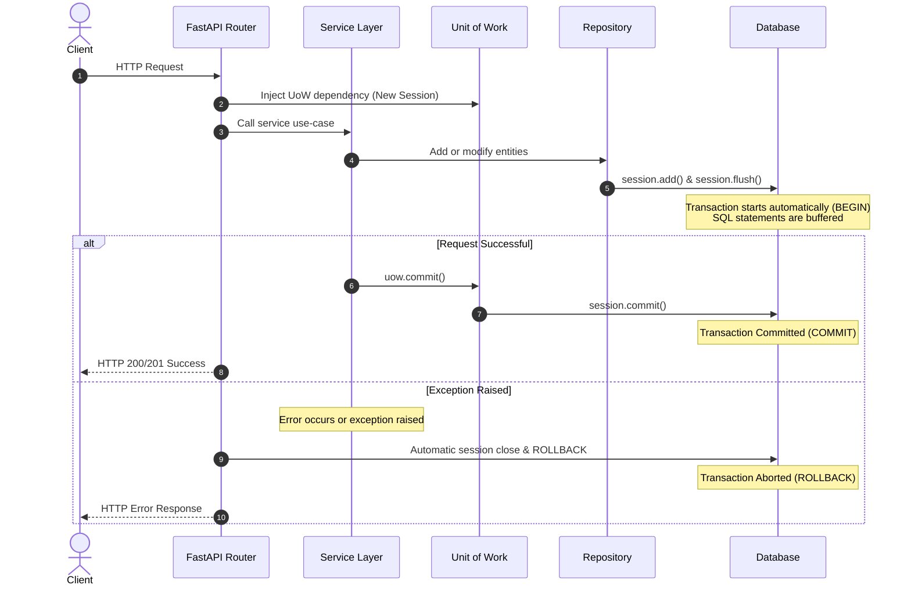
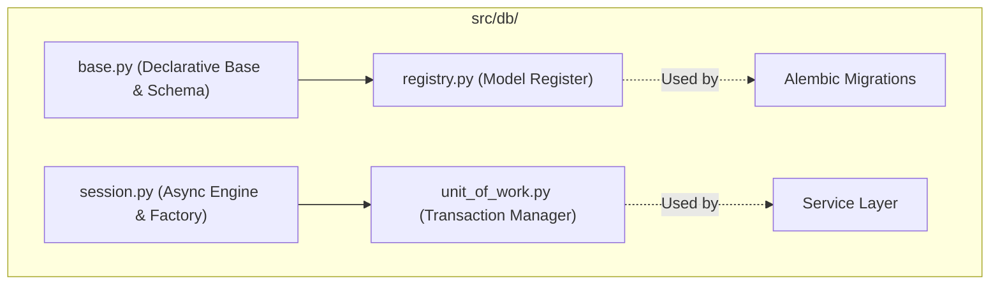

# Database Architecture & Operations in AsyncPulse

This document outlines the database concepts, session management, and transaction patterns used in the AsyncPulse application.

---

## 1. Synchronous vs. Asynchronous Engines

AsyncPulse is built on FastAPI and Uvicorn, which utilize an asynchronous event loop. To avoid blocking this event loop during database operations, the application uses an **asynchronous database engine**.

| Concept | Synchronous Engine (`create_engine`) | Asynchronous Engine (`create_async_engine`) |
| :--- | :--- | :--- |
| **I/O Model** | Blocking I/O | Non-blocking (async/await) I/O |
| **Driver** | e.g., `psycopg2` | e.g., `asyncpg` |
| **Concurrency** | Threads or processes (high resource usage) | Single-threaded event loop (extremely efficient) |
| **FastAPI Fit** | Blocks the event loop; degrades performance | Integrates natively with async endpoints |

### Event Loop Execution Flow



---

## 2. The SQLAlchemy Session

A `Session` (or `AsyncSession` in our async code) serves as an in-memory workspace (similar to a Git staging area) that tracks changes.

* **Identity Map**: The Session maintains a unique registry of all database objects loaded or added.
* **Unit of Work**: It tracks all insertions, updates, and deletions and translates them into SQL statements when needed.

---

## 3. Flush vs. Commit

Understanding the difference between `flush` and `commit` is crucial for writing correct transactional code.



### Detailed Comparison

* **`flush()`**:
  * Sends SQL write statements (`INSERT`, `UPDATE`, `DELETE`) to the database transaction buffer.
  * The database executes the commands but **does not make them permanent**.
  * Database-generated fields (like serial IDs, UUIDs, or default timestamps) are returned and populated on the Python objects.
  * Changes are isolated—other database connections cannot see these updates yet.
* **`commit()`**:
  * Finalizes the current database transaction.
  * Triggers a `flush()` first if there are any outstanding unstaged changes.
  * Writes the changes permanently to disk and makes them visible to all other transactions.

---

## 4. Autoflush

By default, SQLAlchemy session factories are configured with `autoflush=True`. This keeps the database transaction in sync with in-memory changes before any query executes.

### Why Autoflush is Essential



---

## 5. Transactions and the Unit of Work Pattern

### Implicit Transactions

SQLAlchemy 2.0 uses **implicit transactions** (Begin-on-first-use). The session does not start a transaction when instantiated. Instead, it issues a `BEGIN` statement automatically on the very first query or database write you perform.

### Unit of Work (UoW) Pattern

In AsyncPulse, we encapsulate transaction boundaries inside the `UnitOfWork` class. Repositories write to the session, but **never** call `commit()`. Instead, the service layer controls the commit boundaries.

### FastAPI Request Lifecycle Flow



---

## 6. Database Setup & Configuration in AsyncPulse

The database setup in this codebase is modularized under `src/db/`. It is structured to handle asynchronous connections, model registry, and transaction boundaries cleanly.



### File-by-File Breakdown

#### 1. base.py — The Declarative Base

* **Role**: Configures the root `DeclarativeBase` that all models inherit from.
* **Key Config**: Sets up the table `MetaData` to automatically direct all tables to our specific database namespace schema (configured via `settings.DB_SCHEMA` from our environment variables):

  ```python
  class Base(DeclarativeBase):
      metadata = MetaData(schema=settings.DB_SCHEMA)
  ```

#### 2. session.py — Async Engine & Sessions

* **Role**: Creates the singleton async engine and defines the FastAPI session dependency.
* **Key Configs**:
  * **`create_async_engine`**: Connects using the async engine pool.
  * **`connect_args`**:
    * `"search_path"`: Restricts the Postgres lookup scope to the application schema (`settings.DB_SCHEMA`) and `public`.
    * `"statement_cache_size": 0`: Disabled to prevent caching issues when executing dynamic queries.
  * **`async_sessionmaker`**: Configured with `expire_on_commit=False` so that model attributes remain accessible in memory even after a session commit (avoiding `DetachedInstanceError`).
  * **`get_async_session()`**: A FastAPI dependency yielding one session per request.

  ```python
  engine = create_async_engine(
      settings.DATABASE_URL,
      echo=settings.DEBUG,
      connect_args={
          "server_settings": {
              "search_path": f'"{settings.DB_SCHEMA}",public',
          },
          "statement_cache_size": 0,
      },
  )

  async_session_factory = async_sessionmaker(
      engine,
      class_=AsyncSession,
      expire_on_commit=False,
  )
  ```

#### 3. registry.py — Model Discovery for Alembic

* **Role**: Ensures Alembic is aware of all models for migration autogeneration.
* **Mechanism**: Explicitly imports all database models (e.g., `UserModel`, `SessionModel`) to load them into Python memory and populate `Base.metadata`.
* **Export**: Exposes `target_metadata = Base.metadata`, which is imported in Alembic’s `env.py`.

  ```python
  from src.db.base import Base
  from src.modules.auth.models import SessionModel
  from src.modules.users.models import UserModel

  # All models must be imported above target_metadata
  target_metadata = Base.metadata
  ```

#### 4. unit_of_work.py — Transaction Orchestration

* **Role**: Implements the Unit of Work pattern to separate data writing (repositories) from transaction finalization (services).
* **Composition**: Wraps the active `AsyncSession` and provides clean `commit()` and `rollback()` boundaries.

  ```python
  class UnitOfWork:
      def __init__(self, session: AsyncSession) -> None:
          self.session = session

      async def commit(self) -> None:
          await self.session.commit()

      async def rollback(self) -> None:
          await self.session.rollback()
  ```
