# 14 — How Python Interprets & Executes Code

> Python is a **compiled-then-interpreted** language. Source code is first compiled to platform-independent **bytecode**, which is then executed by the **Python Virtual Machine (PVM)**. This two-stage process is invisible to the developer but understanding it unlocks insight into performance, imports, and debugging.

---

## 1. The Execution Pipeline (Big Picture)

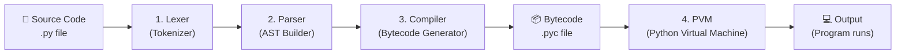

| Stage | Input | Output | What Happens |
| ------- | ------- | -------- | ------------- |
| **Lexer** | Raw source text | Token stream | Breaks code into tokens (keywords, identifiers, operators, literals) |
| **Parser** | Token stream | AST (Abstract Syntax Tree) | Validates grammar, builds tree structure of the program |
| **Compiler** | AST | Bytecode (`.pyc`) | Generates low-level instructions for the PVM |
| **PVM** | Bytecode | Program execution | Interprets bytecode instructions one at a time |

---

## 2. Stage 1 — Lexical Analysis (Tokenization)

> **Lexer (Tokenizer)**: Reads raw source code character by character and groups them into **tokens** — the smallest meaningful units of the language (keywords, names, numbers, operators, delimiters).

```python
# Source code:
x = 42 + y

# Tokenized into:
# NAME     'x'
# OP       '='
# NUMBER   '42'
# OP       '+'
# NAME     'y'
# NEWLINE
```

You can inspect tokens yourself:

```python
import tokenize
import io

code = "x = 42 + y"
tokens = tokenize.generate_tokens(io.StringIO(code).readline)
for tok in tokens:
    print(tok)
# TokenInfo(type=1 (NAME),    string='x',  ...)
# TokenInfo(type=55 (OP),     string='=',  ...)
# TokenInfo(type=2 (NUMBER),  string='42', ...)
# TokenInfo(type=55 (OP),     string='+',  ...)
# TokenInfo(type=1 (NAME),    string='y',  ...)
```

### Key Points

- **Indentation is significant**: The lexer emits `INDENT` and `DEDENT` tokens to represent block structure. This is why Python doesn't need `{}` braces.
- **Comments are stripped**: Comments are discarded at this stage and never reach the parser.
- Syntax errors like unterminated strings (`"hello`) are caught here.

---

## 3. Stage 2 — Parsing (AST Construction)

> **Parser**: Consumes the token stream, validates it against Python's grammar rules, and builds an **Abstract Syntax Tree (AST)** — a tree representation of the program's structure where each node represents a language construct.

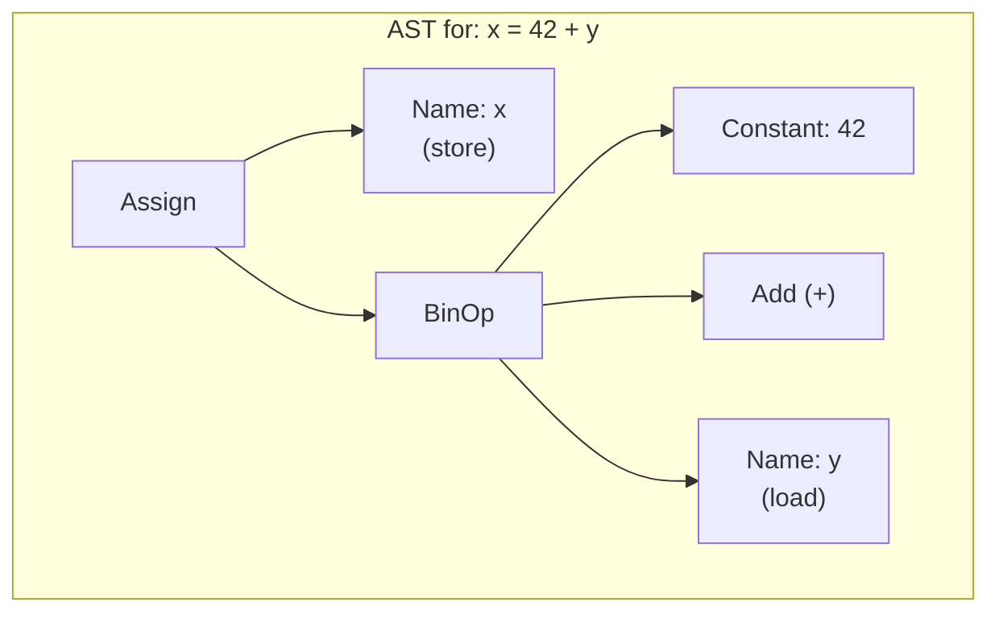

You can inspect the AST:

```python
import ast

code = "x = 42 + y"
tree = ast.parse(code)
print(ast.dump(tree, indent=2))

# Module(body=[
#   Assign(
#     targets=[Name(id='x', ctx=Store())],
#     value=BinOp(
#       left=Constant(value=42),
#       op=Add(),
#       right=Name(id='y', ctx=Load())
#     )
#   )
# ])
```

### Why the AST Matters

- **Linters and formatters** (ruff, black) work by parsing source into an AST, transforming it, and rendering it back.
- **Macros and code generation**: Libraries can inspect and modify the AST before compilation.
- `SyntaxError` is raised at this stage when the token stream doesn't match Python's grammar.

---

## 4. Stage 3 — Compilation (Bytecode Generation)

> **Bytecode**: A low-level, platform-independent set of instructions that the Python Virtual Machine can execute. Each instruction is a simple operation like "load a value", "call a function", or "jump to an offset". Bytecode is cached in `.pyc` files inside `__pycache__/` directories.

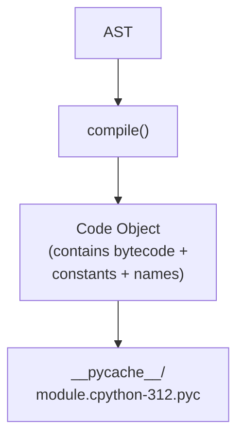

You can inspect bytecode with the `dis` module:

```python
import dis

def add(a, b):
    return a + b

dis.dis(add)
#   0 RESUME                 0
#   2 LOAD_FAST              0 (a)
#   4 LOAD_FAST              1 (b)
#   6 BINARY_OP              0 (+)
#  10 RETURN_VALUE
```

### Bytecode Instructions Cheat Sheet

| Instruction | What It Does |
| ------------- | ------------- |
| `LOAD_FAST` | Push a local variable onto the stack |
| `LOAD_GLOBAL` | Push a global variable onto the stack |
| `LOAD_CONST` | Push a constant (number, string, `None`) |
| `STORE_FAST` | Pop the top of stack into a local variable |
| `BINARY_OP` | Pop two values, apply operator, push result |
| `CALL_FUNCTION` | Call a callable with arguments from the stack |
| `RETURN_VALUE` | Return the top of stack to the caller |
| `JUMP_FORWARD` | Unconditional jump (for `if`/`else`) |
| `POP_JUMP_IF_FALSE` | Conditional jump (branch) |

### The Code Object

Every function, module, and class body is compiled into a **code object** that bundles:

```python
def greet(name):
    return f"Hello, {name}!"

code = greet.__code__
code.co_name        # 'greet'
code.co_varnames    # ('name',)     — local variable names
code.co_consts      # (None, 'Hello, ', '!')  — literal constants
code.co_stacksize   # 3             — max stack depth needed
code.co_code        # b'\x97\x00...' — raw bytecode bytes
```

---

## 5. Stage 4 — Execution (The Python Virtual Machine)

> **PVM (Python Virtual Machine)**: A **stack-based interpreter** that reads bytecode instructions one at a time, manipulates a value stack, and executes the program. It is not a hardware VM — it is a loop in C code (in CPython) that processes instructions.

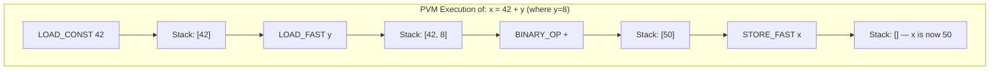

### The Evaluation Loop

The PVM's core is a `while True` loop in C (`Python/ceval.c` in CPython) that:

1. **Fetches** the next bytecode instruction
2. **Decodes** the opcode and argument
3. **Executes** the operation (push, pop, call, jump, etc.)
4. **Advances** the instruction pointer

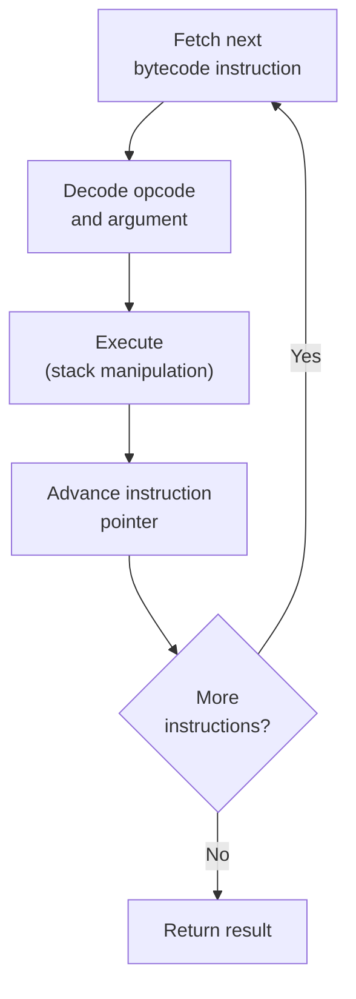

---

## 6. The `.pyc` Cache System

> When Python imports a module, it checks if a valid `.pyc` file exists in `__pycache__/`. If so, it skips re-compilation and loads the cached bytecode directly — a significant speedup for large projects.

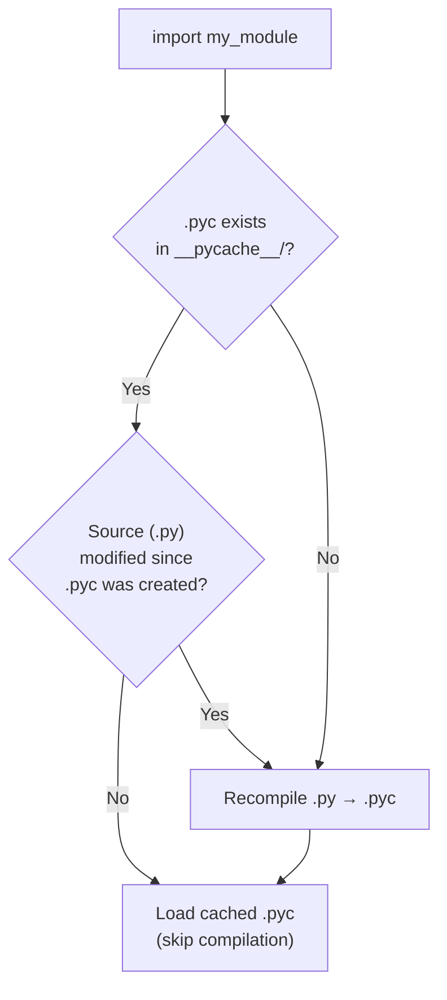

```text
__pycache__/
├── module.cpython-312.pyc    ← Python 3.12
├── module.cpython-311.pyc    ← Python 3.11
└── utils.cpython-312.pyc
```

### Key Caching Behavior

- `.pyc` files are per-Python-version (the version is encoded in the filename).
- The entry-point script (`python main.py`) is **never** cached — only imported modules are.
- You can force recompilation with `python -B` (no `.pyc` writing) or by deleting `__pycache__/`.

---

## 7. Name Resolution at Runtime

> Python resolves names dynamically at runtime using **namespace dictionaries**. Each scope (local, enclosing, global, built-in) is backed by a `dict` that maps names to objects.

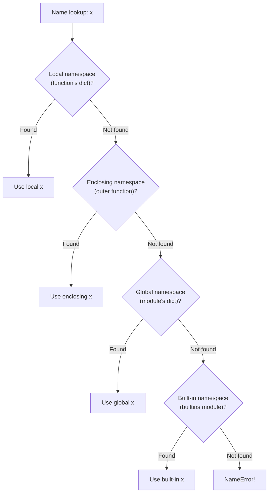

```python
import dis

x = 10            # global

def outer():
    y = 20        # enclosing
    def inner():
        z = 30    # local
        print(x)  # LOAD_GLOBAL  — found in global namespace
        print(y)  # LOAD_DEREF   — found in enclosing (closure cell)
        print(z)  # LOAD_FAST    — found in local namespace
    return inner
```

> The compiler decides **at compile time** (not runtime) which instruction to use for each name based on where it's assigned in the source. This is why assigning to a name inside a function makes it local throughout the entire function — even before the assignment line.

---

## 8. Object Model — Everything is an Object

> In Python, everything is an object: integers, strings, functions, classes, modules, even `None`. Every object has a **type**, an **identity** (`id()`), and a **value**.

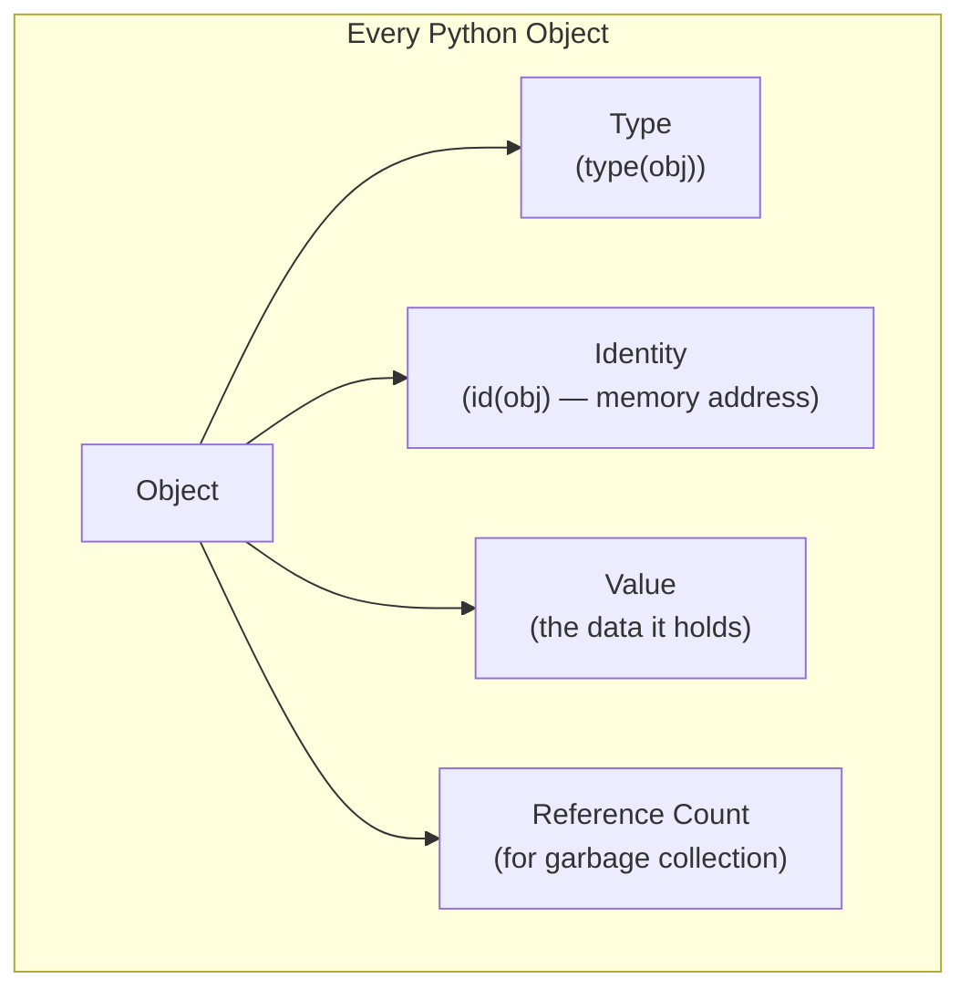

```python
x = 42

type(x)     # <class 'int'>  — the object's type
id(x)       # 140234567890  — unique identity (memory address in CPython)
x           # 42             — the value

# Functions are objects too
def greet(): pass
type(greet)         # <class 'function'>
greet.__name__      # 'greet'
greet.__code__      # <code object greet at 0x...>
```

---

## 9. Memory Management & Garbage Collection

> **Reference Counting**: CPython's primary memory management strategy. Every object has a counter tracking how many names/references point to it. When the count drops to zero, the memory is immediately freed.
>
> **Cyclic Garbage Collector**: A secondary mechanism that detects and collects reference cycles (e.g., object A references B, and B references A) that reference counting alone cannot handle.

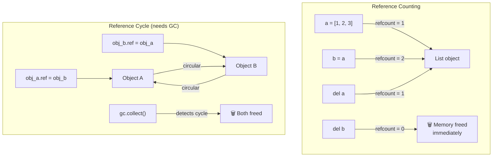

```python
import sys
import gc

a = [1, 2, 3]
sys.getrefcount(a)   # 2 (one for `a`, one for the getrefcount argument)

b = a
sys.getrefcount(a)   # 3

del b
sys.getrefcount(a)   # 2

# Manual garbage collection control
gc.collect()            # force a collection cycle
gc.get_stats()          # collection statistics
gc.disable()            # disable automatic collection (rarely needed)
```

---

## 10. CPython Internals — Integer & String Caching

> CPython pre-allocates and caches small integers (`-5` to `256`) and certain strings (that look like identifiers) for performance. This is an implementation detail — do **not** rely on it in your code.

```python
# Small integer caching
a = 256
b = 256
a is b   # True  — same cached object

a = 257
b = 257
a is b   # False — different objects (outside cache range)

# String interning
x = "hello"
y = "hello"
x is y   # True  — Python interns short, identifier-like strings

x = "hello world!"
y = "hello world!"
x is y   # False — spaces/punctuation prevent automatic interning
```

> **Rule**: Always use `==` for value comparison. Use `is` only for `None`, `True`, and `False`.

---

## 11. End-to-End Execution Example

```python
# File: example.py
def square(n):
    return n * n

result = square(5)
print(result)
```

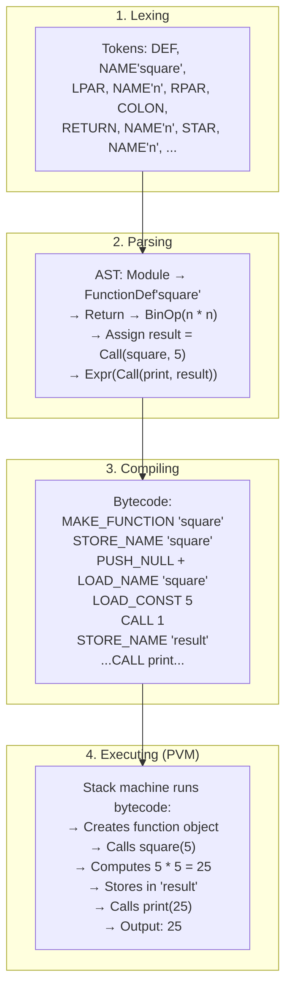

---

## 12. Summary — Mental Model

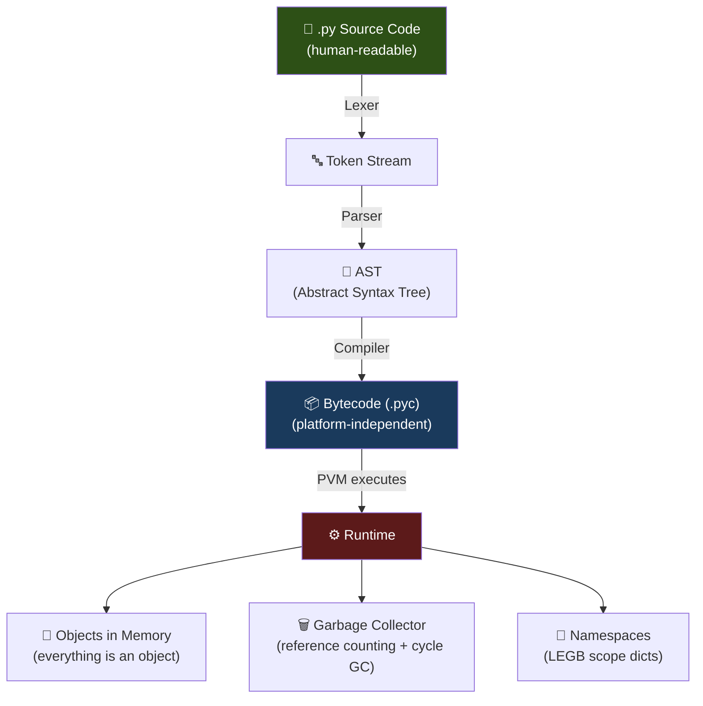

> **Key Takeaway**: Python does compile your code — just not to machine code. It compiles to bytecode, which is then interpreted by the PVM. This is why Python is often called "interpreted" even though compilation is an essential step in the process.
