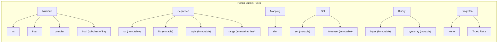
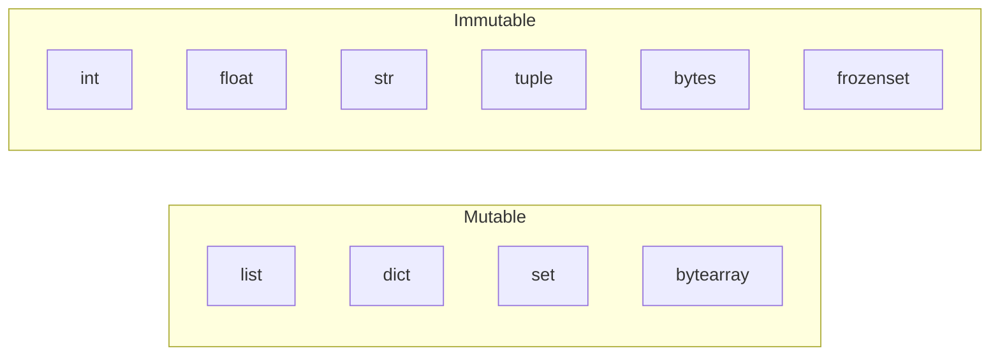
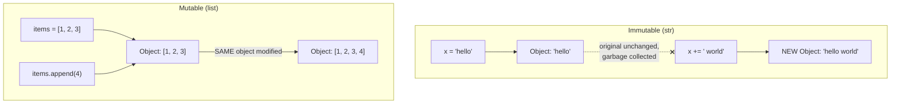
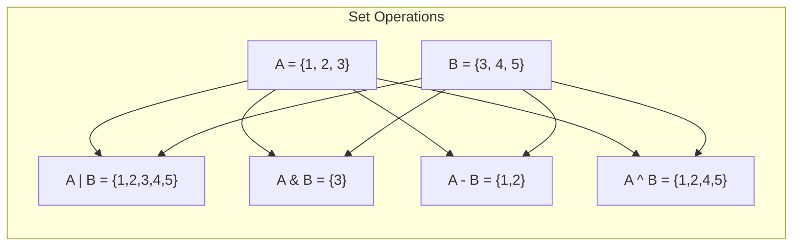
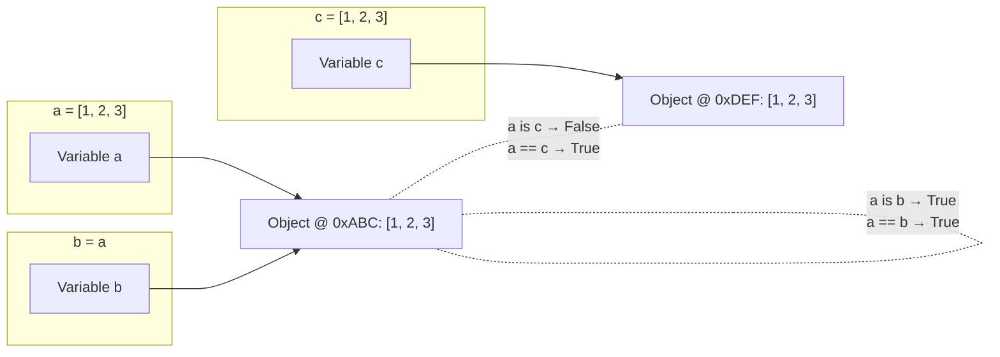

# 01 — Data Types

> **Dynamic Typing**: Variable types are determined at runtime, not at compile time. A variable is simply a name bound to an object — it can be rebound to any type at any time.
>
> **Strong Typing**: Python does not silently coerce incompatible types. `"3" + 5` raises `TypeError` rather than producing `"35"` or `8`.

---

## 1. Core Built-in Types



| Category | Types |
|----------|-------|
| **Numeric** | `int`, `float`, `complex`, `bool` |
| **Sequence** | `str`, `list`, `tuple`, `range` |
| **Mapping** | `dict` |
| **Set** | `set`, `frozenset` |
| **Binary** | `bytes`, `bytearray`, `memoryview` |
| **Singleton** | `None`, `True`, `False` |

---

## 2. Mutability

> **Mutable**: The object's internal state can be changed after creation (e.g., appending to a list).
>
> **Immutable**: Once created, the object's value cannot be modified. Any operation that appears to change it actually creates a new object.



| Mutable | Immutable |
|---------|-----------|
| `list` | `tuple` |
| `dict` | `str` |
| `set` | `int`, `float`, `bool` |
| `bytearray` | `bytes`, `frozenset` |

```python
# Immutable: rebinds the name, does not modify the original object
x = "hello"
x += " world"  # Creates a NEW string object

# Mutable: modifies the object in place
items = [1, 2, 3]
items.append(4)  # The same list object is modified

# Gotcha: mutable default arguments
def bad(items=[]):     # BAD: the list is shared across all calls
    items.append(1)
    return items

def good(items=None):  # GOOD: create a fresh list each call
    if items is None:
        items = []
    items.append(1)
    return items
```

### How Mutability Affects Variable Assignment



---

## 3. Numbers

> **Arbitrary Precision**: Python `int` has no fixed size limit — it grows as large as memory allows. No overflow.
>
> **IEEE 754**: Python `float` follows the IEEE 754 double-precision standard (64-bit), which introduces tiny rounding errors with decimal fractions.

```python
# int: arbitrary precision (no overflow in Python)
big = 10 ** 100

# float: IEEE 754 double precision
0.1 + 0.2  # 0.30000000000000004 (floating point imprecision)

# Use decimal for financial calculations
from decimal import Decimal
Decimal("0.1") + Decimal("0.2")  # Decimal('0.3')

# complex
z = 3 + 4j
z.real   # 3.0
z.imag   # 4.0

# bool is a subclass of int
isinstance(True, int)  # True
True + True            # 2
```

---

## 4. Strings

> **String**: An immutable sequence of Unicode code points. Because strings are immutable, every modification operation (concatenation, replacement, etc.) returns a new string object.

```python
# Multi-line strings
text = """
First line
Second line
"""

# Raw strings (no escape processing)
path = r"C:\Users\name\Documents"

# f-strings (recommended for formatting since Python 3.6)
name = "Alex"
greeting = f"Hello, {name}!"
pi = f"Pi is approximately {3.14159:.2f}"

# Common string methods
"  hello  ".strip()          # "hello"
"hello world".split()        # ["hello", "world"]
", ".join(["a", "b", "c"])   # "a, b, c"
"hello".upper()              # "HELLO"
"Hello World".replace("World", "Python")  # "Hello Python"
"hello".startswith("he")     # True
"hello world".find("world")  # 6

# String are sequences — support indexing and slicing
s = "Python"
s[0]    # "P"
s[-1]   # "n"
s[1:4]  # "yth"
s[::-1] # "nohtyP"   (reversed)
```

### Slicing Cheat Sheet

```
 +---+---+---+---+---+---+
 | P | y | t | h | o | n |
 +---+---+---+---+---+---+
   0   1   2   3   4   5
  -6  -5  -4  -3  -2  -1

 s[start:stop:step]
 s[1:4]  → "yth"   (index 1 up to but NOT including 4)
 s[:3]   → "Pyt"   (from start)
 s[3:]   → "hon"   (to end)
 s[::-1] → "nohtyP" (reversed)
```

---

## 5. Lists

> **List**: An ordered, mutable, dynamically-sized array of references to objects. Supports heterogeneous types but typically holds homogeneous data.

```python
nums = [3, 1, 4, 1, 5]

# Modification
nums.append(9)             # [3, 1, 4, 1, 5, 9]
nums.insert(0, 0)          # [0, 3, 1, 4, 1, 5, 9]
nums.extend([6, 5])        # appends multiple items
nums.remove(1)             # removes FIRST occurrence of value 1
popped = nums.pop()        # removes and returns last item
popped = nums.pop(0)       # removes and returns item at index 0

# Sorting
nums.sort()                # in-place sort
nums.sort(reverse=True)    # descending
sorted_copy = sorted(nums) # returns a NEW sorted list; original unchanged

# Other
nums.count(1)              # count occurrences
nums.index(4)              # find index of first occurrence
nums.reverse()             # in-place reverse
len(nums)                  # length
nums.copy()                # shallow copy (also: nums[:])
```

### Time Complexity of List Operations

| Operation | Complexity | Notes |
|-----------|-----------|-------|
| `append()` | O(1) amortized | |
| `pop()` (last) | O(1) | |
| `pop(0)` (first) | O(n) | Use `deque` if frequent |
| `insert(0, x)` | O(n) | Shifts all elements |
| `x in list` | O(n) | Linear search |
| `sort()` | O(n log n) | Timsort |
| Index access `list[i]` | O(1) | |

---

## 6. Tuples

> **Tuple**: An ordered, immutable sequence. Because tuples are immutable and hashable (if all elements are hashable), they can be used as dictionary keys and set members. Tuples are faster than lists for iteration.

```python
point = (3, 4)
x, y = point  # unpacking

# Single element tuple requires trailing comma
single = (42,)    # tuple
not_tuple = (42)  # just an int!

# Named tuples: like a lightweight struct
from collections import namedtuple
Point = namedtuple("Point", ["x", "y"])
p = Point(3, 4)
p.x   # 3
p._asdict()  # OrderedDict([('x', 3), ('y', 4)])
```

---

## 7. Dictionaries

> **Dictionary (Hash Map)**: An unordered (but insertion-ordered since 3.7) mapping of unique, hashable keys to values. Implemented as a hash table, providing O(1) average-case lookups.
>
> **Hashable**: An object is hashable if it has a hash value that never changes during its lifetime and can be compared to other objects. All immutable built-in types are hashable.

```python
user = {"name": "Alex", "age": 30}

# Access
user["name"]              # "Alex"
user.get("email", "N/A")  # "N/A" (safe access with default)

# Modification
user["email"] = "alex@example.com"  # add/update
del user["age"]                      # remove

# Iteration
for key in user:             pass  # iterate keys
for key, val in user.items(): pass  # iterate key-value pairs
list(user.keys())
list(user.values())

# Merging (Python 3.9+)
merged = {"a": 1} | {"b": 2}      # {"a": 1, "b": 2}
base = {"a": 1}
base |= {"b": 2}                   # in-place merge

# setdefault
counts = {}
counts.setdefault("apples", 0)
counts["apples"] += 1

# defaultdict avoids KeyError for missing keys
from collections import defaultdict
dd = defaultdict(list)
dd["users"].append("Alex")  # no KeyError; creates [] if key absent
```

---

## 8. Sets

> **Set**: An unordered collection of unique, hashable elements. Built on hash tables, providing O(1) average membership testing. Ideal for deduplication and set-theoretic operations.



```python
a = {1, 2, 3}
b = {3, 4, 5}

a | b   # Union:        {1, 2, 3, 4, 5}
a & b   # Intersection: {3}
a - b   # Difference:   {1, 2}
a ^ b   # Symmetric difference: {1, 2, 4, 5}

a.add(6)
a.remove(1)       # raises KeyError if not found
a.discard(99)     # safe removal — no error if not found

# frozenset: immutable set (can be used as dict key)
frozen = frozenset([1, 2, 3])
```

---

## 9. Type Hints and the `typing` Module

> **Type Hints** (PEP 484): Optional annotations on variables, function arguments, and return values. They are not enforced at runtime — they serve as documentation and enable static analysis tools (`mypy`, `pyright`) to catch type errors before execution.

```python
# Basic annotations
name: str = "Alex"
count: int = 0
values: list[int] = [1, 2, 3]     # Python 3.9+
mapping: dict[str, int] = {}

# Optional (allows None)
from typing import Optional
def get_user(user_id: int) -> Optional[str]:
    return None

# Python 3.10+ shorthand
def get_user(user_id: int) -> str | None:
    return None

# Union types
from typing import Union
def process(data: Union[str, bytes]) -> str: ...

# Callable
from typing import Callable
def apply(fn: Callable[[int], str], val: int) -> str:
    return fn(val)

# TypeVar for generics
from typing import TypeVar
T = TypeVar("T")
def first(items: list[T]) -> T:
    return items[0]
```

---

## 10. Identity vs. Equality

> **Identity (`is`)**: Tests whether two names point to the exact same object in memory (same `id()`).
>
> **Equality (`==`)**: Tests whether two objects have the same value (calls `__eq__`).



```python
a = [1, 2, 3]
b = a           # b is the SAME object
c = [1, 2, 3]   # c is an EQUAL but DIFFERENT object

a == c   # True   (same value)
a is c   # False  (different objects)
a is b   # True   (same object)

# Use `is` only for checking against singletons: None, True, False
if value is None:  # correct
if value == None:  # works but discouraged
```
