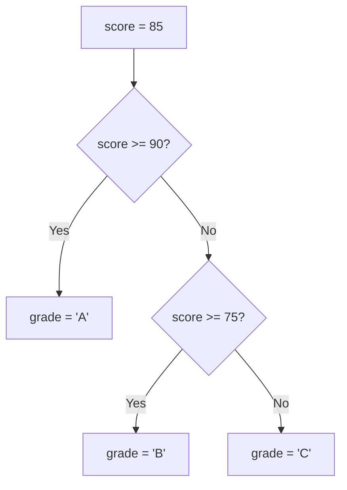
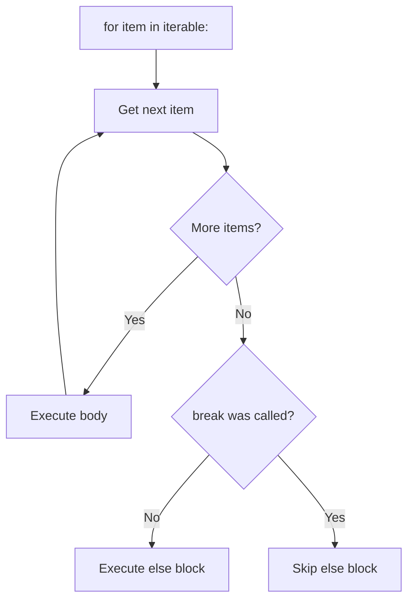
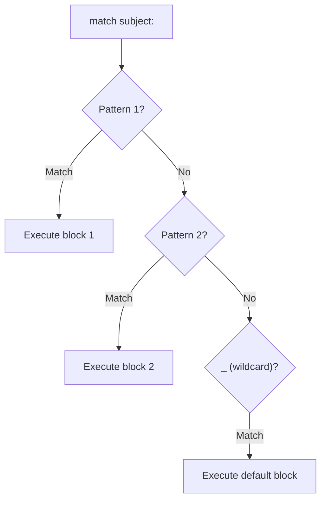
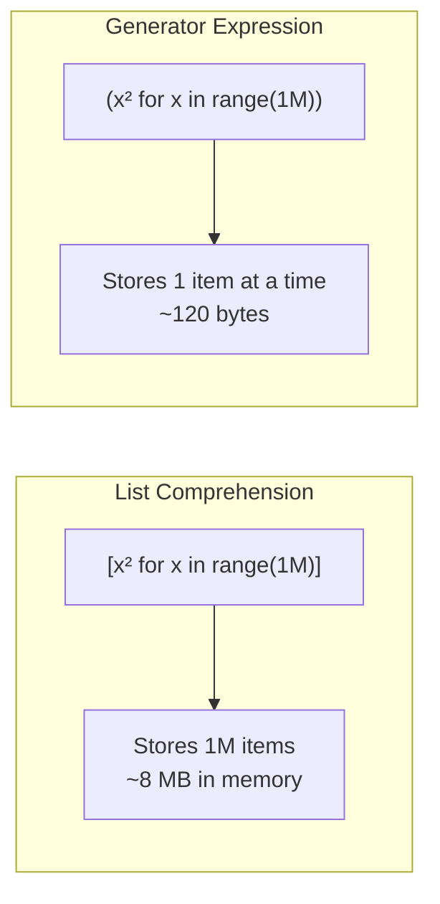

# 02 — Control Flow & Comprehensions

---

## 1. Conditionals

> **Conditional Statement**: Directs program execution along different paths based on boolean evaluation of expressions. Python uses `if`, `elif`, and `else` keywords with indentation-based blocks.



```python
# Standard if/elif/else
score = 85
if score >= 90:
    grade = "A"
elif score >= 75:
    grade = "B"
else:
    grade = "C"

# Ternary expression (conditional expression)
status = "pass" if score >= 50 else "fail"

# Walrus operator := (Python 3.8+)
# Assigns and tests in one expression
import re
if match := re.search(r"\d+", "order123"):
    print(match.group())  # "123"
```

### Truthy and Falsy Values

> **Falsy**: A value that evaluates to `False` in a boolean context. Python has a fixed set of falsy values — everything else is truthy.

| Falsy Values | Truthy Values |
|-------------|---------------|
| `None` | Any non-zero number |
| `0`, `0.0`, `0j` | Non-empty strings |
| `""` (empty string) | Non-empty collections |
| `[]`, `()`, `{}`, `set()` | Any object (by default) |
| `False` | `True` |

```python
if not []:
    print("empty list is falsy")

# Short-circuit evaluation:
name = user_input or "default"   # uses "default" if user_input is falsy
```

---

## 2. Loops

> **Iterable**: Any object that can return its elements one at a time (implements `__iter__`). Lists, strings, dicts, files, generators — all are iterables.

### `for` loops



```python
# Iterate over any iterable
for item in [1, 2, 3]:
    print(item)

# enumerate: get index + value together
fruits = ["apple", "banana", "cherry"]
for index, fruit in enumerate(fruits):
    print(f"{index}: {fruit}")

# enumerate with start index
for index, fruit in enumerate(fruits, start=1):
    print(f"{index}: {fruit}")

# zip: iterate two iterables in parallel
names = ["Alice", "Bob"]
scores = [95, 87]
for name, score in zip(names, scores):
    print(f"{name}: {score}")

# range: generates integer sequences lazily
for i in range(10):        # 0–9
    pass
for i in range(2, 10, 2):  # 2, 4, 6, 8
    pass
```

### `while` loops

```python
count = 0
while count < 5:
    count += 1

# Useful pattern: loop with sentinel
while True:
    data = input("Enter value (q to quit): ")
    if data == "q":
        break
    process(data)
```

### Loop Control Keywords

| Keyword | Effect |
|---------|--------|
| `break` | Exit the loop immediately. Skips the `else` block. |
| `continue` | Skip the rest of the current iteration and go to the next one. |
| `else` (on loop) | Runs only if the loop completed without `break`. |

```python
for i in range(10):
    if i == 3:
        continue   # skip this iteration
    if i == 7:
        break      # exit the loop entirely
else:
    # The else block runs only if the loop completed WITHOUT a break
    print("Loop finished normally")
```

---

## 3. `match` Statement (Python 3.10+)

> **Structural Pattern Matching**: A control flow mechanism that tests a value against a series of patterns. Unlike `switch/case` in other languages, it can destructure sequences, mappings, and objects, extracting values into variables.



```python
command = "go north"

match command.split():
    case ["go", direction]:
        print(f"Moving {direction}")
    case ["stop"]:
        print("Stopping")
    case _:
        print("Unknown command")

# Match against types and values
def process(event):
    match event:
        case {"type": "login", "user": str(user)}:
            print(f"User logged in: {user}")
        case {"type": "logout"}:
            print("User logged out")
        case _:
            print("Unknown event")

# Match with guard conditions
def classify(n):
    match n:
        case x if x < 0:
            return "negative"
        case 0:
            return "zero"
        case x if x > 0:
            return "positive"
```

---

## 4. Comprehensions

> **Comprehension**: A concise, declarative syntax for constructing new collections (list, dict, set, or generator) by transforming and/or filtering elements from an existing iterable — all in a single expression.

### Syntax Comparison

```
List:      [expression for item in iterable if condition]    → list
Dict:      {key: val  for item in iterable if condition}     → dict
Set:       {expression for item in iterable if condition}    → set
Generator: (expression for item in iterable if condition)    → lazy iterator
```

### List Comprehensions

```python
# Basic pattern: [expression for item in iterable if condition]
squares = [x**2 for x in range(10)]
evens = [x for x in range(20) if x % 2 == 0]

# Equivalent for loop (less idiomatic):
evens = []
for x in range(20):
    if x % 2 == 0:
        evens.append(x)

# Nested loops: outer loop first, inner loop second
pairs = [(x, y) for x in range(3) for y in range(3) if x != y]
# [(0, 1), (0, 2), (1, 0), (1, 2), (2, 0), (2, 1)]

# Flattening a nested list
matrix = [[1, 2], [3, 4], [5, 6]]
flat = [item for row in matrix for item in row]
# [1, 2, 3, 4, 5, 6]
```

### Dictionary Comprehensions

```python
# {key_expr: value_expr for item in iterable if condition}
squares = {x: x**2 for x in range(6)}
# {0: 0, 1: 1, 2: 4, 3: 9, 4: 16, 5: 25}

# Invert a dictionary
original = {"a": 1, "b": 2, "c": 3}
inverted = {v: k for k, v in original.items()}
# {1: "a", 2: "b", 3: "c"}

# Filter a dictionary
filtered = {k: v for k, v in original.items() if v > 1}
# {"b": 2, "c": 3}
```

### Set Comprehensions

```python
# {expression for item in iterable}
unique_lengths = {len(word) for word in ["apple", "banana", "kiwi", "fig"]}
# {3, 4, 5, 6}
```

### Generator Expressions

> **Generator Expression**: A memory-efficient, lazy comprehension that produces values one at a time on demand instead of building the entire collection in memory. Uses `()` instead of `[]`.



```python
# Use () instead of []
gen = (x**2 for x in range(10))

# Consume with next()
print(next(gen))  # 0
print(next(gen))  # 1

# Or iterate normally
for val in gen:
    print(val)

# Memory efficiency comparison
import sys
list_comp = [x**2 for x in range(1_000_000)]   # ~8 MB
gen_exp   = (x**2 for x in range(1_000_000))   # ~120 bytes

# Can be passed directly to functions that accept iterables
total = sum(x**2 for x in range(100))          # no extra [] needed
any_even = any(x % 2 == 0 for x in [1, 3, 4])
```

---

## 5. When to Use What

| Use Case | Recommended |
|----------|-------------|
| Build a list in memory and reuse it | List comprehension |
| One-pass processing of a large sequence | Generator expression |
| Build a dict from a mapping | Dict comprehension |
| Collect unique values | Set comprehension |
| Complex transformation logic | Regular `for` loop (more readable) |
| Pattern matching on structure | `match` statement |
