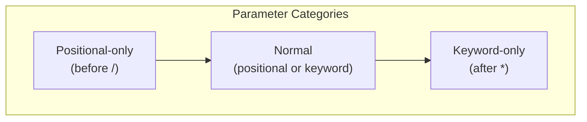
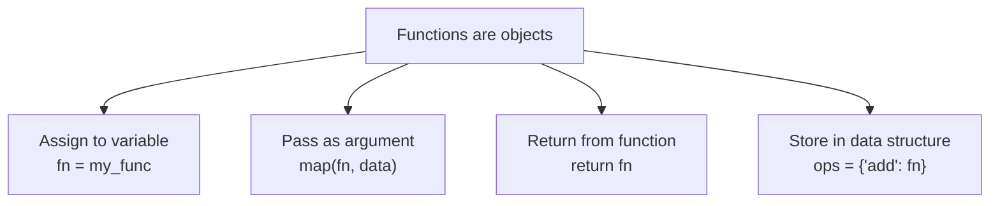
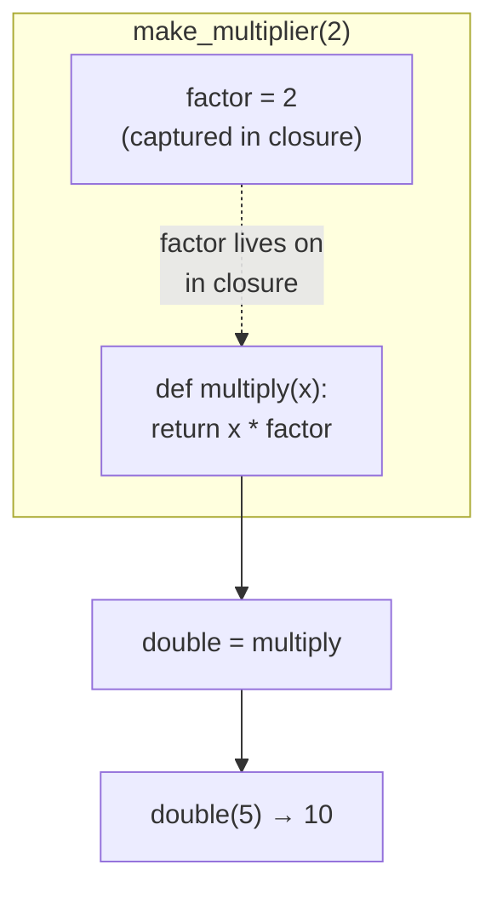
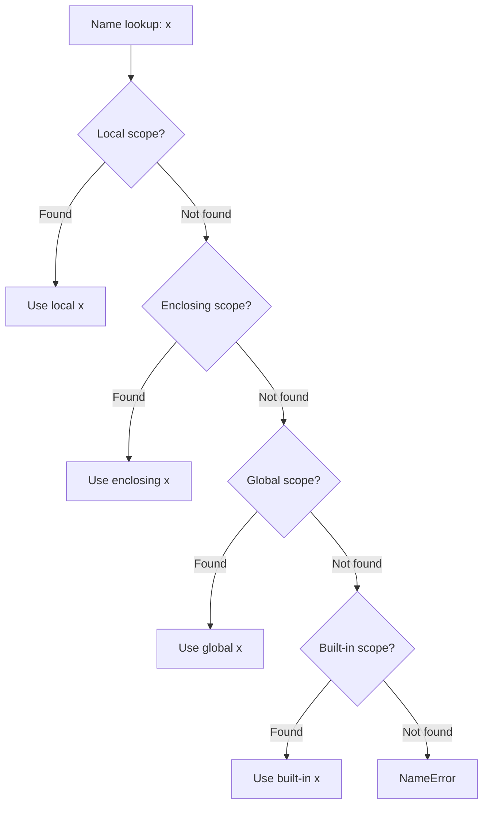

# 03 — Functions

> **Function**: A named, reusable block of code that takes inputs (arguments), performs a computation, and optionally returns an output. Functions are first-class objects in Python — they can be assigned to variables, passed as arguments, and returned from other functions.

---

## 1. Defining Functions

```python
def greet(name: str, greeting: str = "Hello") -> str:
    """Return a greeting string.

    Args:
        name: The person's name.
        greeting: The greeting prefix. Defaults to "Hello".

    Returns:
        A formatted greeting string.
    """
    return f"{greeting}, {name}!"
```

---

## 2. Argument Types

> Python has four categories of function parameters, separated by special markers `/` and `*`.



```
def f(pos_only, /, normal, *, kw_only):
       ─────────  ──────   ────────
       positional  either   keyword
       only                 only
```

```python
def demo(pos_only, /, normal, *, kw_only):
    """
    pos_only:  positional-only (before /)
    normal:    can be positional or keyword
    kw_only:   keyword-only (after *)
    """
    pass

demo(1, 2, kw_only=3)        # OK
demo(1, normal=2, kw_only=3) # OK
demo(pos_only=1, ...)         # TypeError — pos_only cannot be keyword
```

### `*args` and `**kwargs`

> **`*args`**: Collects extra positional arguments into a `tuple`.
>
> **`**kwargs`**: Collects extra keyword arguments into a `dict`.

```python
# *args: variable positional arguments (receives a tuple)
def add(*args: int) -> int:
    return sum(args)

add(1, 2, 3)  # 6

# **kwargs: variable keyword arguments (receives a dict)
def create_user(**kwargs):
    return kwargs

create_user(name="Alex", age=30)  # {"name": "Alex", "age": 30}

# Combining all
def everything(a, b=10, *args, key="default", **kwargs):
    pass
```

---

## 3. Unpacking into Function Calls

```python
args = [1, 2, 3]
print(*args)  # equivalent to print(1, 2, 3)

kwargs = {"sep": "-", "end": "\n"}
print("a", "b", **kwargs)  # equivalent to print("a", "b", sep="-", end="\n")
```

---

## 4. Lambda Functions

> **Lambda**: A small, anonymous, single-expression function created inline. Returns the result of the expression automatically (no `return` keyword needed).

```python
double = lambda x: x * 2
double(5)   # 10

# Common use: as a key function for sorting
people = [{"name": "Bob", "age": 25}, {"name": "Alice", "age": 30}]
sorted_people = sorted(people, key=lambda p: p["age"])

# Multiple parameters
add = lambda x, y: x + y
```

> **Rule of thumb**: If a lambda is complex or used more than once, define a proper `def` function instead.

---

## 5. First-Class Functions

> **First-Class Object**: An entity that can be created at runtime, assigned to a variable, passed as an argument, and returned from a function. In Python, functions are first-class objects.



```python
def apply(fn, value):
    return fn(value)

def double(x):
    return x * 2

apply(double, 5)    # 10
apply(str.upper, "hello")  # "HELLO"

# Store functions in a dict (dispatch table pattern)
operations = {
    "add": lambda x, y: x + y,
    "sub": lambda x, y: x - y,
}
operations["add"](3, 4)   # 7
```

---

## 6. Closures

> **Closure**: A function object that remembers values from its enclosing lexical scope, even after the outer function has finished executing. The inner function "closes over" the free variables.



```python
def make_multiplier(factor: int):
    """Returns a closure that multiplies by factor."""
    def multiply(x: int) -> int:
        return x * factor   # 'factor' is captured from the enclosing scope
    return multiply

double = make_multiplier(2)
triple = make_multiplier(3)

double(5)   # 10
triple(5)   # 15

# The `nonlocal` keyword lets you modify the enclosing scope variable
def make_counter():
    count = 0
    def increment():
        nonlocal count   # without this, count would be read-only
        count += 1
        return count
    return increment

counter = make_counter()
counter()  # 1
counter()  # 2
counter()  # 3
```

---

## 7. `functools` Module

```python
import functools

# partial: pre-fill some arguments of a function
def power(base, exponent):
    return base ** exponent

square = functools.partial(power, exponent=2)
cube   = functools.partial(power, exponent=3)

square(5)  # 25
cube(3)    # 27

# reduce: fold a sequence into a single value
from functools import reduce
product = reduce(lambda acc, x: acc * x, [1, 2, 3, 4, 5])  # 120

# lru_cache: memoize expensive function calls
@functools.lru_cache(maxsize=128)
def fibonacci(n: int) -> int:
    if n < 2:
        return n
    return fibonacci(n - 1) + fibonacci(n - 2)

fibonacci(50)   # fast, computed once and cached
fibonacci.cache_info()  # CacheInfo(hits=48, misses=51, ...)
fibonacci.cache_clear() # clear the cache

# cache (Python 3.9+): same as lru_cache(maxsize=None)
@functools.cache
def factorial(n):
    return n * factorial(n - 1) if n else 1
```

---

## 8. Scope Resolution — The LEGB Rule

> Python resolves variable names by searching four scopes in order: **L**ocal → **E**nclosing → **G**lobal → **B**uilt-in. The first match wins.



```python
x = "global"             # Global scope

def outer():
    x = "enclosing"      # Enclosing scope
    def inner():
        x = "local"      # Local scope
        print(x)         # "local"
    inner()

# Keywords to modify scope:
# global x    → assign to the global scope from within a function
# nonlocal x  → assign to the enclosing scope from within a nested function
```

---

## 9. Function Introspection

```python
def greet(name: str, greeting: str = "Hello") -> str:
    """Return a greeting."""
    return f"{greeting}, {name}!"

greet.__name__        # "greet"
greet.__doc__         # "Return a greeting."
greet.__annotations__ # {"name": str, "greeting": str, "return": str}

import inspect
inspect.signature(greet)    # (name: str, greeting: str = 'Hello') -> str
inspect.getsource(greet)    # source code as string
```
