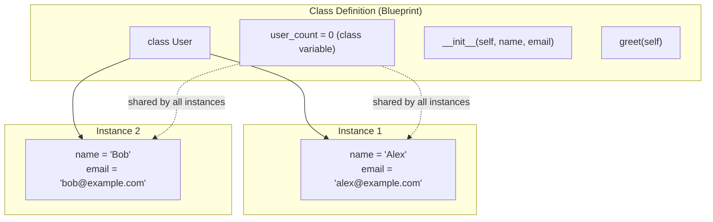
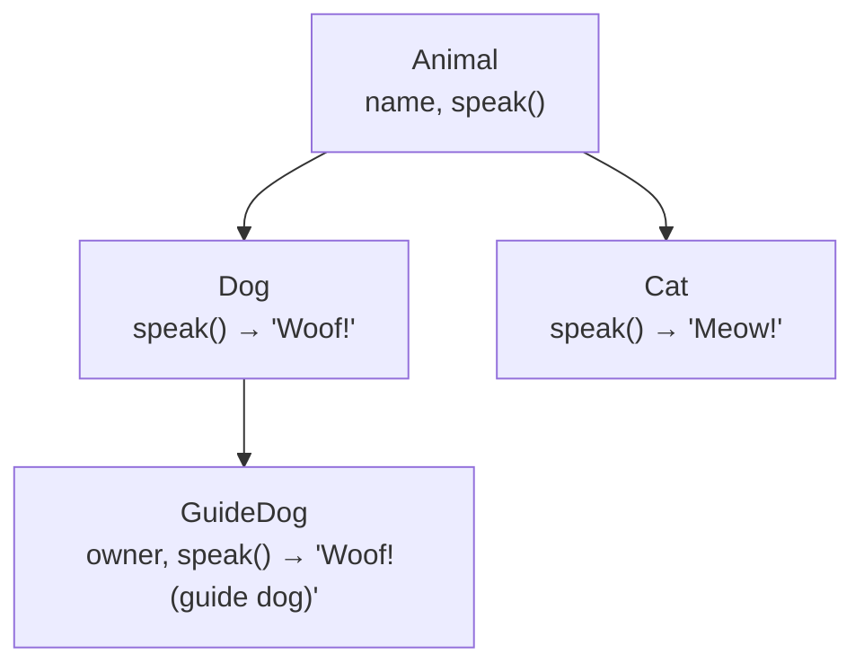
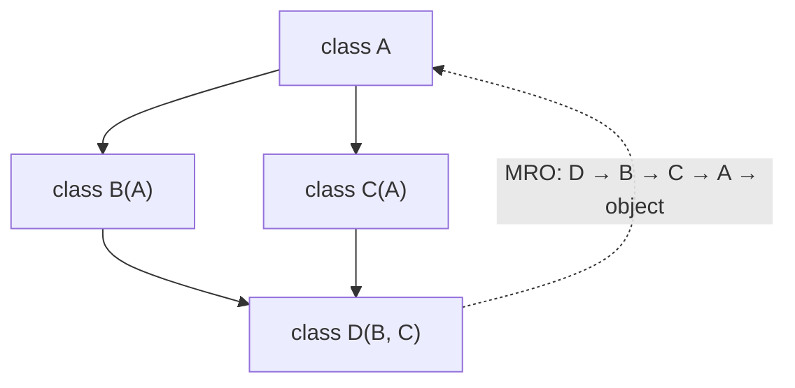
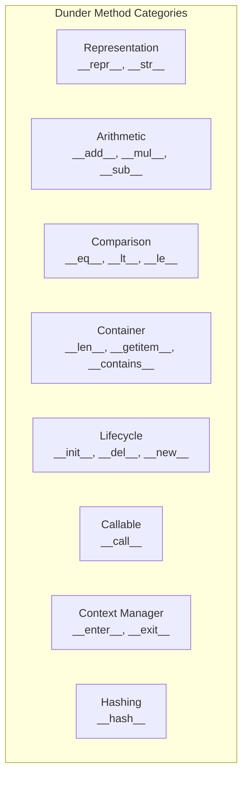
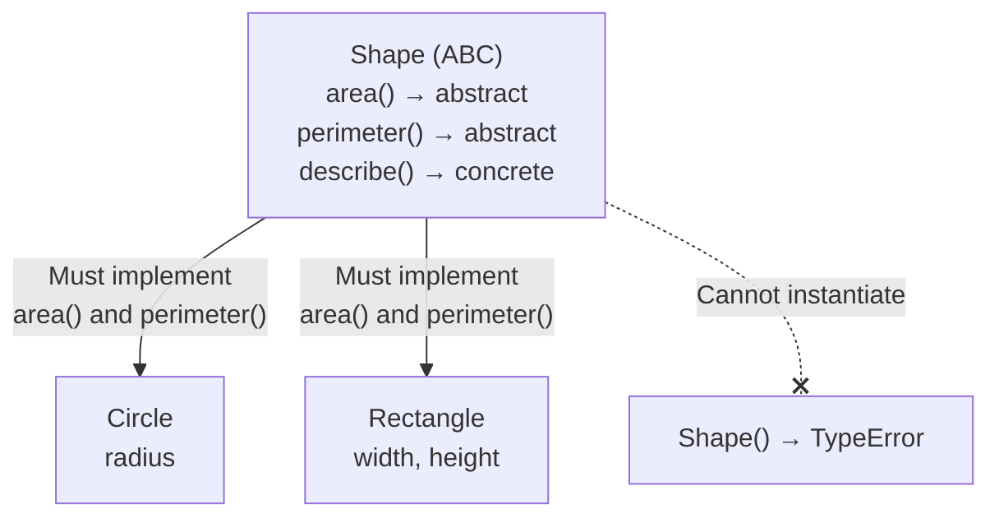
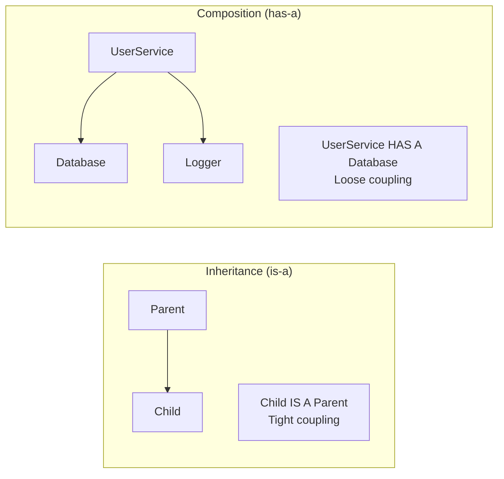

# 04 — Object-Oriented Programming

> **OOP** is a programming paradigm that organizes code around objects — instances of classes that bundle data (attributes) and behavior (methods) together. Python supports OOP but does not enforce it; you can mix procedural, functional, and OOP styles.

---

## 1. Classes and Instances

> **Class**: A blueprint or template for creating objects. It defines the attributes and methods that its instances will have.
>
> **Instance**: A specific object created from a class. Each instance has its own copy of instance attributes.



```python
class User:
    # Class variable: shared across all instances
    user_count: int = 0

    def __init__(self, name: str, email: str) -> None:
        """Instance initializer."""
        # Instance variables: unique per instance
        self.name = name
        self.email = email
        User.user_count += 1

    def greet(self) -> str:
        """Instance method: receives self."""
        return f"Hi, I'm {self.name}"

    @classmethod
    def get_count(cls) -> int:
        """Class method: receives cls instead of self."""
        return cls.user_count

    @staticmethod
    def validate_email(email: str) -> bool:
        """Static method: no access to instance or class."""
        return "@" in email

    def __repr__(self) -> str:
        """Unambiguous string representation (for debugging)."""
        return f"User(name={self.name!r}, email={self.email!r})"

    def __str__(self) -> str:
        """Human-readable string representation."""
        return self.name


u = User("Alex", "alex@example.com")
print(u)          # Alex   (calls __str__)
repr(u)           # User(name='Alex', email='alex@example.com')
User.get_count()  # 1
User.validate_email("bad")  # False
```

### Method Types at a Glance

| Decorator | First Argument | Can Access Instance? | Can Access Class? | Use Case |
|-----------|---------------|---------------------|-------------------|----------|
| (none) | `self` | ✅ | ✅ via `self.__class__` | Most methods |
| `@classmethod` | `cls` | ❌ | ✅ | Factory methods, class state |
| `@staticmethod` | (none) | ❌ | ❌ | Utility functions grouped in class |

---

## 2. Inheritance

> **Inheritance**: A mechanism where a child class (subclass) derives attributes and methods from a parent class (superclass), enabling code reuse and specialization.



```python
class Animal:
    def __init__(self, name: str) -> None:
        self.name = name

    def speak(self) -> str:
        raise NotImplementedError

class Dog(Animal):
    def speak(self) -> str:
        return "Woof!"

class Cat(Animal):
    def speak(self) -> str:
        return "Meow!"


# Calling parent's method
class GuideDog(Dog):
    def __init__(self, name: str, owner: str) -> None:
        super().__init__(name)  # call parent __init__
        self.owner = owner

    def speak(self) -> str:
        parent_sound = super().speak()
        return f"{parent_sound} (guide dog)"
```

### Multiple Inheritance & MRO

> **MRO (Method Resolution Order)**: The order in which Python searches base classes when looking up a method. Follows the C3 linearization algorithm (left to right, depth-first, but skipping duplicates).



```python
class A:
    def method(self): return "A"

class B(A):
    def method(self): return "B"

class C(A):
    def method(self): return "C"

class D(B, C):
    pass

D().method()     # "B"  — Method Resolution Order (MRO) left to right
D.__mro__        # (D, B, C, A, object)
```

---

## 3. Key Dunder Methods

> **Dunder Methods** (double underscore, e.g., `__init__`, `__add__`): Special methods that Python calls implicitly in response to operations like `+`, `len()`, `str()`, indexing, and comparison. They let your class integrate with Python's built-in protocols.



```python
class Vector:
    def __init__(self, x: float, y: float) -> None:
        self.x = x
        self.y = y

    # Arithmetic operators
    def __add__(self, other: "Vector") -> "Vector":
        return Vector(self.x + other.x, self.y + other.y)

    def __mul__(self, scalar: float) -> "Vector":
        return Vector(self.x * scalar, self.y * scalar)

    # Comparison
    def __eq__(self, other: object) -> bool:
        if not isinstance(other, Vector):
            return NotImplemented
        return self.x == other.x and self.y == other.y

    def __lt__(self, other: "Vector") -> bool:
        return abs(self) < abs(other)

    # Length (for abs() and len())
    def __abs__(self) -> float:
        return (self.x**2 + self.y**2) ** 0.5

    # Makes the object callable
    def __call__(self, scale: float) -> "Vector":
        return self * scale

    # String representations
    def __repr__(self) -> str:
        return f"Vector({self.x}, {self.y})"

    # Container protocol
    def __len__(self) -> int:
        return 2

    def __getitem__(self, index: int) -> float:
        return (self.x, self.y)[index]

    # Hashing (required if __eq__ is defined)
    def __hash__(self) -> int:
        return hash((self.x, self.y))
```

---

## 4. Properties

> **Property**: A managed attribute that runs getter, setter, or deleter code when accessed, assigned, or deleted. Properties let you expose a clean `obj.attribute` syntax while hiding validation and computation behind the scenes.

```python
class Temperature:
    def __init__(self, celsius: float) -> None:
        self._celsius = celsius   # underscore: convention for "private"

    @property
    def celsius(self) -> float:
        """Read-only access to celsius."""
        return self._celsius

    @celsius.setter
    def celsius(self, value: float) -> None:
        if value < -273.15:
            raise ValueError("Temperature below absolute zero!")
        self._celsius = value

    @property
    def fahrenheit(self) -> float:
        """Computed property — no storage needed."""
        return self._celsius * 9/5 + 32


t = Temperature(100)
t.celsius     # 100
t.fahrenheit  # 212.0
t.celsius = -300   # raises ValueError
```

---

## 5. Dataclasses

> **Dataclass**: A decorator that auto-generates `__init__`, `__repr__`, `__eq__`, and other boilerplate methods based on class-level type annotations. Ideal for classes that primarily hold data.

```python
from dataclasses import dataclass, field

@dataclass
class Point:
    x: float
    y: float
    z: float = 0.0   # default value

# dataclass auto-generates: __init__, __repr__, __eq__
p1 = Point(1.0, 2.0)
p2 = Point(1.0, 2.0)
p1 == p2   # True


# Mutable default: must use field(default_factory=...)
@dataclass
class Config:
    name: str
    tags: list[str] = field(default_factory=list)
    metadata: dict = field(default_factory=dict)


# frozen=True makes it immutable (and hashable)
@dataclass(frozen=True)
class ImmutablePoint:
    x: float
    y: float

# order=True generates __lt__, __le__, etc. for sorting
@dataclass(order=True)
class Card:
    rank: int
    suit: str
```

---

## 6. Abstract Base Classes (ABCs)

> **ABC**: A class that cannot be instantiated directly. It defines a contract — a set of abstract methods that all subclasses must implement. Used to enforce interface consistency.



```python
from abc import ABC, abstractmethod

class Shape(ABC):
    @abstractmethod
    def area(self) -> float:
        """Compute area of the shape."""
        ...

    @abstractmethod
    def perimeter(self) -> float:
        """Compute perimeter of the shape."""
        ...

    def describe(self) -> str:
        """Concrete method on the abstract base."""
        return f"Area: {self.area():.2f}, Perimeter: {self.perimeter():.2f}"


class Circle(Shape):
    def __init__(self, radius: float) -> None:
        self.radius = radius

    def area(self) -> float:
        import math
        return math.pi * self.radius ** 2

    def perimeter(self) -> float:
        import math
        return 2 * math.pi * self.radius

# Shape()     # TypeError: can't instantiate abstract class
c = Circle(5)
c.describe()  # "Area: 78.54, Perimeter: 31.42"
```

---

## 7. `__slots__`

> **`__slots__`**: A class-level declaration that restricts an instance to a fixed set of attributes. This eliminates the per-instance `__dict__`, reducing memory usage by 30–50% for classes with many instances.

```python
class Point:
    __slots__ = ("x", "y")

    def __init__(self, x, y):
        self.x = x
        self.y = y

# p.z = 5  # AttributeError — cannot add new attributes
```

---

## 8. Composition Over Inheritance

> **Composition**: A design principle where a class achieves complex behavior by containing instances of other classes ("has-a") rather than inheriting from them ("is-a"). Prefer composition for flexibility; use inheritance only when there is a genuine "is-a" relationship.



```python
class Logger:
    def log(self, message: str) -> None:
        print(f"[LOG] {message}")

class Database:
    def __init__(self, url: str) -> None:
        self.url = url

    def query(self, sql: str) -> list:
        return []


class UserService:
    """Uses composition: wraps Logger and Database instead of inheriting them."""
    def __init__(self, db: Database, logger: Logger) -> None:
        self._db = db
        self._logger = logger

    def get_user(self, user_id: int):
        self._logger.log(f"Fetching user {user_id}")
        return self._db.query(f"SELECT * FROM users WHERE id={user_id}")
```
