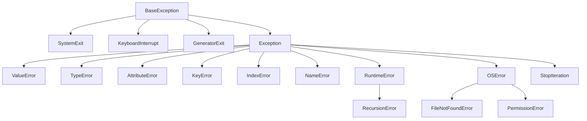
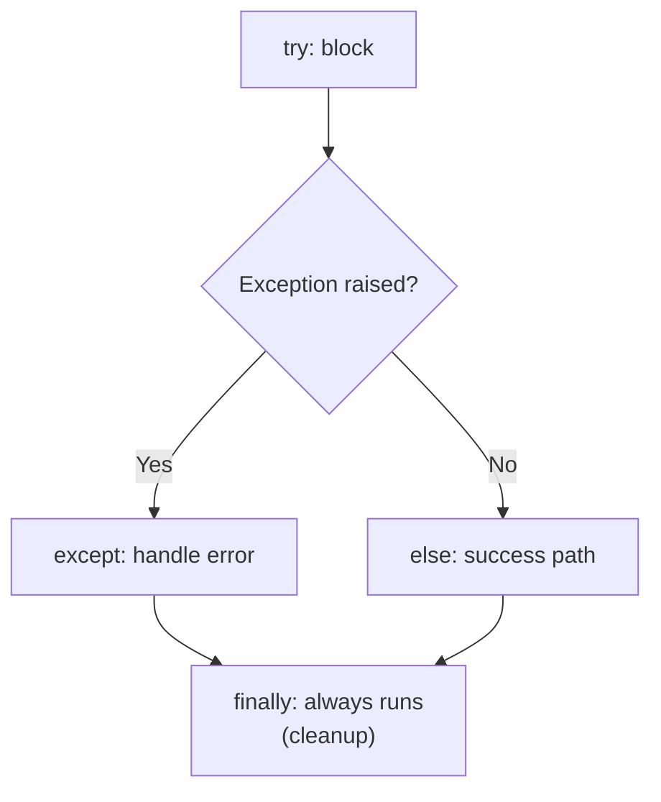
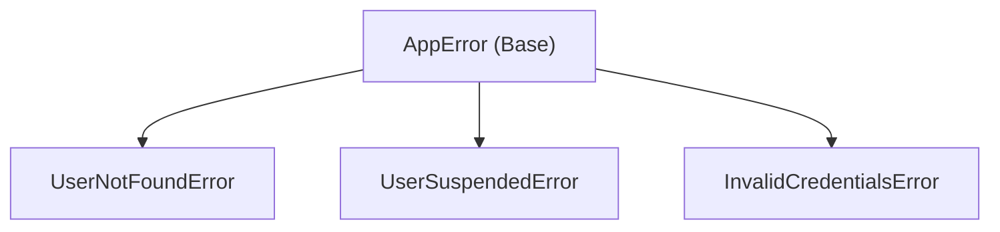
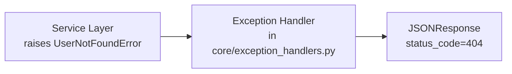

# 05 — Exception Handling

> **Exception**: An event that disrupts the normal flow of a program's execution. When an error occurs, Python creates an exception object containing information about the error. If not handled, the exception propagates up the call stack until it crashes the program.

---

## 1. The Exception Hierarchy

> Python exceptions form a tree rooted at `BaseException`. Application code should typically catch only `Exception` and its subclasses — never `BaseException`, `SystemExit`, or `KeyboardInterrupt`.



---

## 2. try / except / else / finally

> Each block has a distinct role. Together, they form a complete error-handling strategy.



```python
try:
    result = 10 / 0
except ZeroDivisionError:
    print("Cannot divide by zero")
except (ValueError, TypeError) as e:
    print(f"Value or Type error: {e}")
except Exception as e:
    # Catch-all for any other exception — use sparingly
    print(f"Unexpected error: {e}")
    raise  # re-raise without losing the original traceback
else:
    # Runs ONLY if NO exception was raised in try block
    print(f"Result: {result}")
finally:
    # ALWAYS runs — whether an exception occurred or not
    # Use for cleanup (close files, release locks, etc.)
    print("Cleanup done")
```

| Block | When It Runs | Purpose |
|-------|-------------|---------|
| `try` | Always (first) | Code that may raise exceptions |
| `except` | Only if `try` raises a matching exception | Error handling and recovery |
| `else` | Only if `try` succeeds (no exception) | Success-only logic |
| `finally` | Always (last) | Cleanup: close files, release resources |

---

## 3. Raising Exceptions

> **`raise`**: Explicitly creates and throws an exception.
>
> **Exception Chaining (`from`)**: Links a new exception to an original cause, preserving the full traceback context for debugging.

```python
def divide(a: float, b: float) -> float:
    if b == 0:
        raise ZeroDivisionError("Cannot divide by zero")
    return a / b

# Re-raising with additional context (exception chaining)
try:
    result = divide(10, 0)
except ZeroDivisionError as original:
    raise RuntimeError("Calculation failed") from original
    # Traceback shows: "The above exception was the direct cause of..."

# Suppress context (raise without from)
raise RuntimeError("Silent replacement") from None
```

---

## 4. Custom Exceptions

> Define application-specific exceptions to create a clear domain vocabulary for error conditions. Build a hierarchy so callers can catch at the appropriate granularity.



```python
# Base exception for your application or module
class AppError(Exception):
    """Base class for all application-level errors."""
    pass

# Domain-specific exceptions
class UserNotFoundError(AppError):
    def __init__(self, user_id: int) -> None:
        self.user_id = user_id
        super().__init__(f"User with id={user_id} not found")

class UserSuspendedError(AppError):
    def __init__(self, user_id: int, reason: str = "") -> None:
        self.user_id = user_id
        self.reason = reason
        super().__init__(f"User {user_id} is suspended. {reason}")


# Usage
try:
    raise UserNotFoundError(42)
except UserNotFoundError as e:
    print(e)         # "User with id=42 not found"
    print(e.user_id) # 42
```

### Mapping to HTTP Responses (FastAPI Pattern)



```python
# In core/exception_handlers.py
from fastapi import Request
from fastapi.responses import JSONResponse

async def user_not_found_handler(request: Request, exc: UserNotFoundError):
    return JSONResponse(status_code=404, content={"detail": str(exc)})

# Registered in main.py:
# app.add_exception_handler(UserNotFoundError, user_not_found_handler)
```

---

## 5. Exception Best Practices

### EAFP vs. LBYL

> **EAFP** (Easier to Ask Forgiveness than Permission): Try the operation first, handle the exception if it fails. This is the Pythonic style.
>
> **LBYL** (Look Before You Leap): Check preconditions before attempting the operation. More common in C and Java.

```python
# ✅ EAFP (Pythonic)
try:
    value = my_dict["key"]
except KeyError:
    value = "default"

# LBYL (non-Pythonic but still valid)
if "key" in my_dict:
    value = my_dict["key"]
else:
    value = "default"
```

### Other Best Practices

```python
# ✅ GOOD: Catch specific exceptions
try:
    value = d["key"]
except KeyError:
    value = "default"

# ❌ BAD: Catch bare Exception or BaseException
try:
    value = d["key"]
except:                   # catches EVERYTHING, including SystemExit!
    value = "default"

# ✅ GOOD: Log the exception before handling it
import logging
logger = logging.getLogger(__name__)

try:
    result = risky_operation()
except RuntimeError as e:
    logger.error("Operation failed: %s", e, exc_info=True)
    raise

# ✅ GOOD: Use context managers for resource cleanup instead of finally
with open("file.txt") as f:
    data = f.read()
# File is always closed automatically

# ✅ GOOD: contextlib.suppress for intentionally ignored exceptions
from contextlib import suppress
with suppress(FileNotFoundError):
    os.remove("temp.txt")  # no error if file doesn't exist
```

---

## 6. `ExceptionGroup` and `except*` (Python 3.11+)

> **ExceptionGroup**: A container exception that holds multiple exceptions raised concurrently (e.g., from parallel async tasks). `except*` selectively handles subgroups without losing the others.

```python
try:
    raise ExceptionGroup("multiple errors", [
        ValueError("bad value"),
        TypeError("wrong type"),
    ])
except* ValueError as eg:
    print("Caught ValueErrors:", eg.exceptions)
except* TypeError as eg:
    print("Caught TypeErrors:", eg.exceptions)
```
