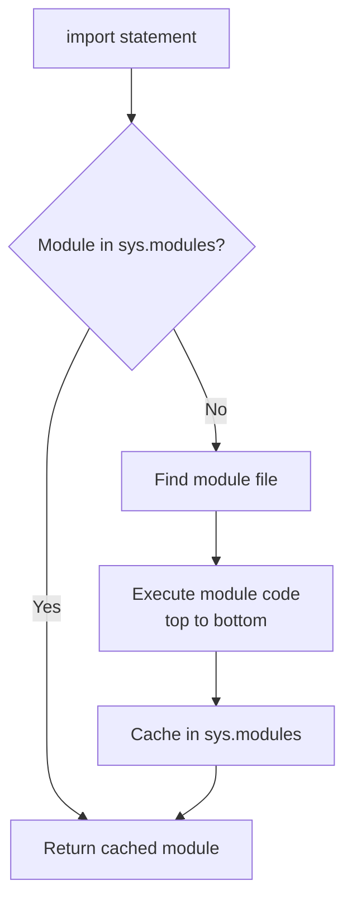
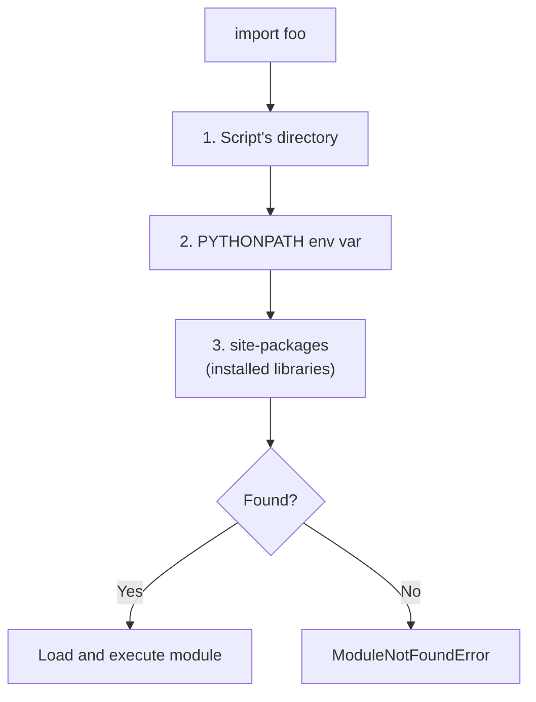
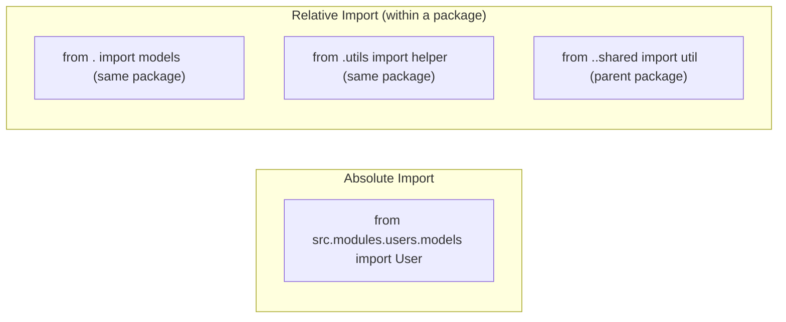
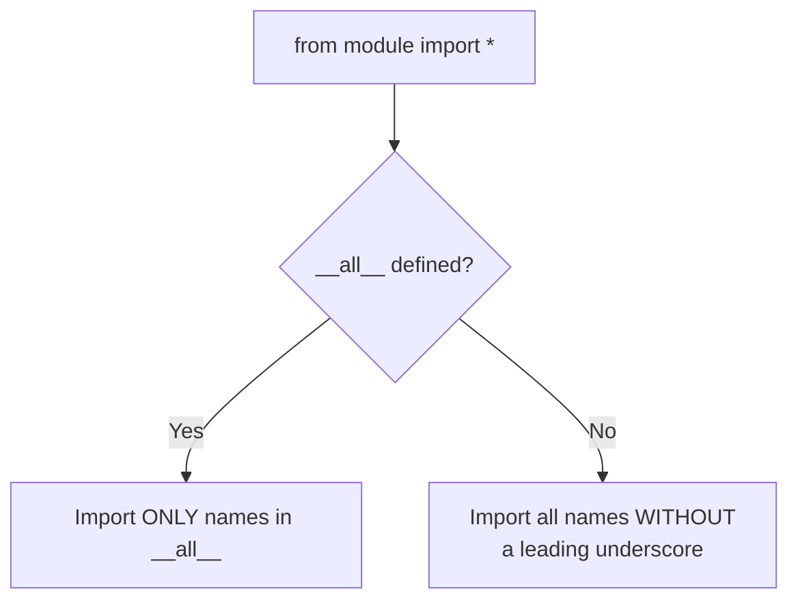
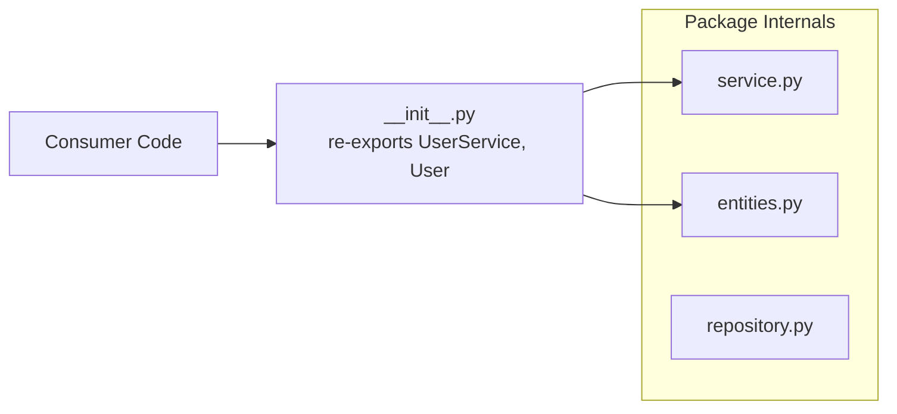

# 06 — Modules & Packages

> **Module**: A single `.py` file containing Python code (functions, classes, variables). It serves as the basic unit of code organization and reuse.
>
> **Package**: A directory of modules containing an `__init__.py` file. Packages allow hierarchical structuring of the module namespace.

---

## 1. Importing Modules



```python
# Import the whole module (recommended for clarity)
import os
os.path.join("/usr", "local", "bin")

# Import specific names from a module
from os.path import join, exists
join("/usr", "local", "bin")

# Import with an alias
import numpy as np
from datetime import datetime as dt

# Wildcard import — AVOID in production code
from os.path import *   # pollutes namespace; hard to trace where names come from
```

---

## 2. How Python Finds Modules (`sys.path`)

> When you write `import foo`, Python searches for `foo.py` (or a package directory `foo/`) through a list of directories in `sys.path`.



```python
import sys
print(sys.path)          # list of directories Python searches

# You can add paths programmatically (usually done in tests or scripts)
sys.path.insert(0, "/custom/path")
```

---

## 3. Module Execution Model

When a module is imported for the first time, Python:

1. Creates a module object
2. Executes the module's code from top to bottom
3. Caches it in `sys.modules`

Subsequent imports of the same module return the cached object (no re-execution).

```python
# The __name__ trick
# When run directly: __name__ == "__main__"
# When imported:     __name__ == "my_module"

def main():
    print("Running as main script")

if __name__ == "__main__":
    main()   # only runs when the file is executed directly
```

---

## 4. Packages

> A package is a directory containing an `__init__.py` file (which can be empty). `__init__.py` runs when the package is imported and can define the package's public API.

```
my_package/
├── __init__.py      ← runs on `import my_package`
├── models.py
└── utils.py
```

```python
# __init__.py controls what `from my_package import *` exposes
# and what's available when you do `import my_package`

# my_package/__init__.py
from .models import User      # relative import
from .utils import helper

__all__ = ["User", "helper"]  # public API
```

### Relative vs Absolute Imports



```python
# Relative imports within the package:
# Use . for current package, .. for parent package
from . import models          # same package
from .utils import helper     # specific name in same package
from ..shared import util     # parent package
```

---

## 5. `__all__` in Detail

> **`__all__`**: A module-level list of strings that defines which names are exported when a consumer does `from module import *`. It also silences "unused import" linter warnings (F401) for intentional re-exports.



```python
# module.py
__all__ = ["PublicClass", "public_function"]

class PublicClass:
    pass

class _PrivateClass:    # underscore prefix: convention for private
    pass

def public_function():
    pass

def _private_function():
    pass

# With __all__ defined:
# from module import *  --> imports PublicClass and public_function only
# Without __all__:
# from module import *  --> imports everything without a leading underscore
```

---

## 6. Reload a Module (Development Only)

```python
import importlib
import my_module

# Force re-execution of the module (useful in REPL/notebooks during development)
importlib.reload(my_module)
```

---

## 7. Common Patterns

### The Facade Pattern with `__init__.py`

> Expose a clean public interface from a package, regardless of internal structure. Consumers import from the package root; internal file organization can change without breaking imports.



```python
# src/modules/users/__init__.py
from .service import UserService
from .entities import User

__all__ = ["UserService", "User"]

# Consumers can do:
from src.modules.users import UserService, User
# Instead of:
from src.modules.users.service import UserService
from src.modules.users.entities import User
```

### Lazy Imports (Performance Optimization)

> For modules that are slow to import, delay the import until it's needed.

```python
def heavy_operation():
    import pandas as pd   # import only when the function is called
    df = pd.DataFrame(...)
    return df
```

### `importlib.import_module` for Dynamic Imports

```python
import importlib

module_name = "json"   # determined at runtime
module = importlib.import_module(module_name)
module.dumps({"key": "value"})  # '{"key": "value"}'
```
