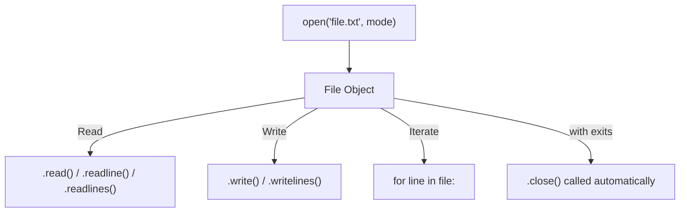
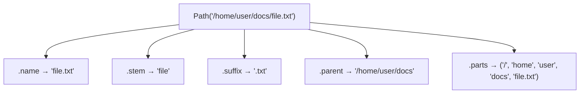

# 07 — File I/O & `pathlib`

---

## 1. Reading and Writing Files

> **File Object**: An object returned by `open()` that provides methods for reading from and writing to files. Always use a context manager (`with`) to ensure the file is closed even if an exception occurs.



```python
# Open modes:
# "r"  - read text (default)
# "w"  - write text (overwrites if exists)
# "a"  - append text
# "rb" - read binary
# "wb" - write binary
# "x"  - exclusive creation (error if file exists)

# Always use a context manager — ensures the file is closed even on error
with open("data.txt", "r", encoding="utf-8") as f:
    content = f.read()          # read entire file as string

with open("data.txt", "r") as f:
    lines = f.readlines()       # list of lines (including \n)

with open("data.txt", "r") as f:
    for line in f:              # memory-efficient line-by-line iteration
        print(line.strip())

# Writing
with open("output.txt", "w", encoding="utf-8") as f:
    f.write("Hello, World!\n")

with open("output.txt", "w") as f:
    lines = ["line 1\n", "line 2\n", "line 3\n"]
    f.writelines(lines)

# Appending
with open("log.txt", "a") as f:
    f.write("New log entry\n")
```

### File Open Modes

| Mode | Description | Creates if missing? | Truncates? |
|------|-------------|--------------------:|----------:|
| `"r"` | Read text | ❌ (FileNotFoundError) | ❌ |
| `"w"` | Write text | ✅ | ✅ (overwrites) |
| `"a"` | Append text | ✅ | ❌ |
| `"x"` | Exclusive create | ✅ (error if exists) | N/A |
| `"rb"` | Read binary | ❌ | ❌ |
| `"wb"` | Write binary | ✅ | ✅ |

---

## 2. Binary Files

```python
# Read binary
with open("image.png", "rb") as f:
    data = f.read()

# Write binary
with open("copy.png", "wb") as f:
    f.write(data)

# Efficient copying using shutil
import shutil
shutil.copy("source.txt", "destination.txt")
shutil.copytree("src_dir/", "dst_dir/")
```

---

## 3. JSON Files

```python
import json

# Read
with open("config.json", "r") as f:
    config = json.load(f)          # file → Python object

# Parse from string
config = json.loads('{"key": "value"}')

# Write
data = {"name": "Alex", "scores": [95, 87, 92]}
with open("output.json", "w") as f:
    json.dump(data, f, indent=2)   # Python object → file

# Serialize to string
json_str = json.dumps(data, indent=2)
```

---

## 4. `pathlib` — Modern File Path Handling

> **Path Object**: An object-oriented abstraction over filesystem paths. Paths are objects — not strings — providing methods for querying, creating, reading, and writing files and directories. Preferred over `os.path` for modern Python.



```python
from pathlib import Path

# Create Path objects
p = Path("/home/user/documents")
p = Path.home() / "documents" / "file.txt"   # uses / operator for joining

# Path components
p.name        # "file.txt"
p.stem        # "file"
p.suffix      # ".txt"
p.parent      # /home/user/documents
p.parts       # ('/home', 'user', 'documents', 'file.txt')

# Checks
p.exists()
p.is_file()
p.is_dir()

# Reading / Writing (no open() needed for simple cases)
text = p.read_text(encoding="utf-8")
p.write_text("Hello", encoding="utf-8")
data = p.read_bytes()
p.write_bytes(b"\x00\x01")

# Directory operations
Path("new_dir").mkdir(parents=True, exist_ok=True)
p.unlink()        # delete file
p.rename("new_name.txt")

# Globbing
for py_file in Path(".").glob("**/*.py"):    # recursive: all .py files
    print(py_file)

for child in Path("src").iterdir():         # list directory contents
    print(child)

# Resolve (absolute, canonical path)
Path("../notes").resolve()   # PosixPath('/home/user/notes')
```

---

## 5. Context Managers for File Handling

```python
from contextlib import contextmanager

@contextmanager
def timer(label: str):
    """Context manager that times a block of code."""
    import time
    start = time.perf_counter()
    try:
        yield
    finally:
        elapsed = time.perf_counter() - start
        print(f"{label}: {elapsed:.4f}s")

with timer("DB Query"):
    import time
    time.sleep(0.5)
# "DB Query: 0.5001s"
```

---

## 6. `tempfile` — Temporary Files

> Temporary files and directories that are automatically cleaned up. Useful for tests, intermediate data, and scratch work.

```python
import tempfile

# Temporary file (deleted when closed)
with tempfile.NamedTemporaryFile(suffix=".json", mode="w", delete=True) as tmp:
    tmp.write('{"test": true}')
    print(tmp.name)  # e.g., /tmp/tmpXXXXXX.json

# Temporary directory (deleted recursively when context exits)
with tempfile.TemporaryDirectory() as tmpdir:
    tmp_path = Path(tmpdir) / "data.txt"
    tmp_path.write_text("temporary data")
```
