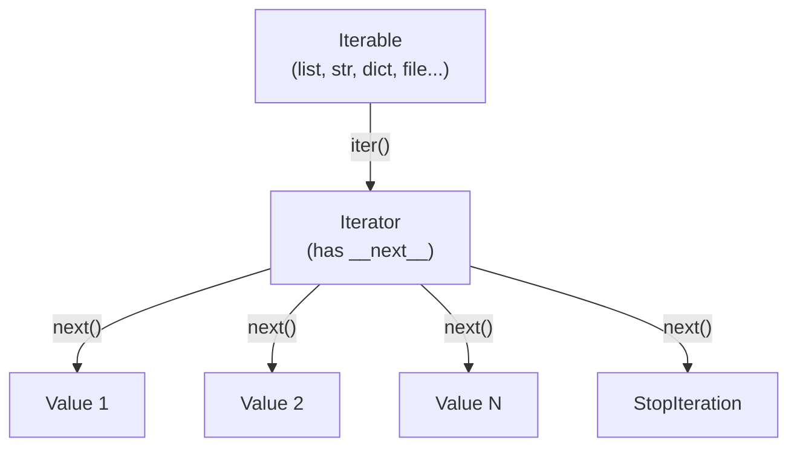
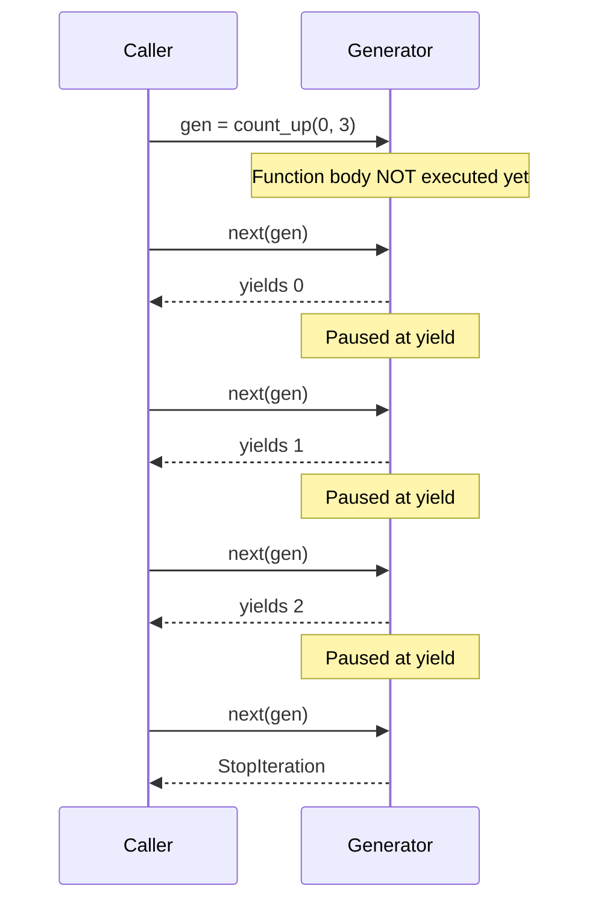
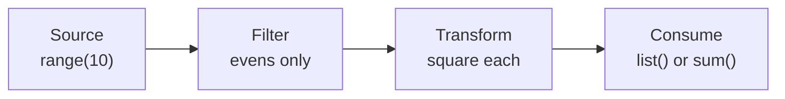
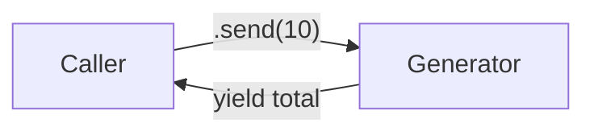
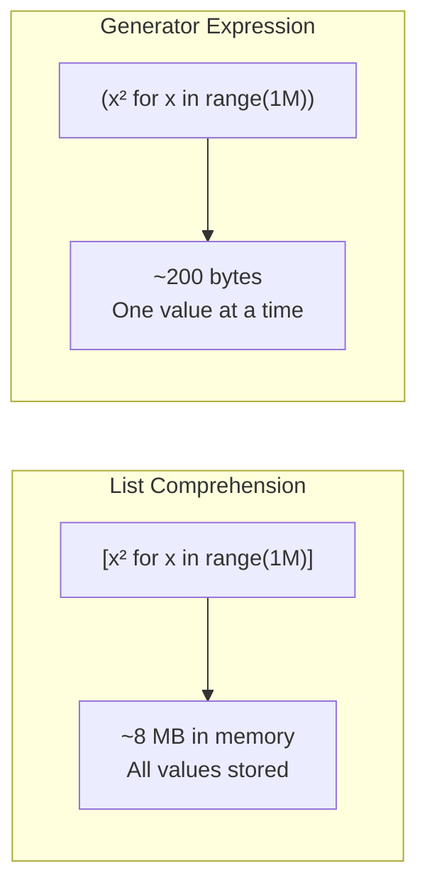

# 08 — Generators & Iterators

---

## 1. The Iterator Protocol

> **Iterable**: Any object with an `__iter__()` method that returns an iterator (e.g., lists, strings, dicts, files).
>
> **Iterator**: An object with both `__iter__()` (returns itself) and `__next__()` (produces the next value or raises `StopIteration`). Iterators are stateful and single-pass.



```python
my_list = [1, 2, 3]
it = iter(my_list)   # Creates an iterator

next(it)  # 1
next(it)  # 2
next(it)  # 3
next(it)  # StopIteration — signals end of sequence

# for loops do this automatically under the hood:
for item in my_list:
    print(item)
# is equivalent to:
it = iter(my_list)
while True:
    try:
        item = next(it)
        print(item)
    except StopIteration:
        break
```

---

## 2. Custom Iterators

```python
class CountUp:
    """Iterates from start up to (not including) stop."""
    def __init__(self, start: int, stop: int) -> None:
        self.current = start
        self.stop = stop

    def __iter__(self):
        return self   # the iterator is itself

    def __next__(self):
        if self.current >= self.stop:
            raise StopIteration
        value = self.current
        self.current += 1
        return value

for n in CountUp(0, 3):
    print(n)  # 0, 1, 2
```

---

## 3. Generator Functions

> **Generator Function**: A function that contains one or more `yield` expressions. When called, it returns a generator object (a lazy iterator) without executing the function body. Each call to `next()` resumes execution from where `yield` last paused it.



```python
def count_up(start: int, stop: int):
    """Generator equivalent of CountUp above — much simpler."""
    current = start
    while current < stop:
        yield current    # pause and produce value; resume on next()
        current += 1

gen = count_up(0, 3)
next(gen)  # 0
next(gen)  # 1
next(gen)  # 2
next(gen)  # StopIteration
```

### Real-World Generator Patterns

```python
def read_large_file(path: str):
    """Yield lines one at a time — avoids loading entire file in memory."""
    with open(path) as f:
        for line in f:
            yield line.strip()

def infinite_sequence():
    """Infinite generator — use with islice or break."""
    n = 0
    while True:
        yield n
        n += 1

from itertools import islice
first_ten = list(islice(infinite_sequence(), 10))
# [0, 1, 2, 3, 4, 5, 6, 7, 8, 9]
```

### Generator Pipelines

> Chain generators for lazy, memory-efficient data processing. Each stage processes one element at a time.



```python
def pipeline(numbers):
    """Chain generators for lazy processing pipelines."""
    filtered = (n for n in numbers if n % 2 == 0)   # filter
    squared  = (n**2 for n in filtered)              # transform
    return squared

result = list(pipeline(range(10)))  # [0, 4, 16, 36, 64]
```

---

## 4. `yield from`

> **`yield from`**: Delegates to a sub-generator, passing through all yielded values, sent values, and exceptions. Eliminates the need for manual `for item in sub: yield item` loops.

```python
def flatten(nested):
    for item in nested:
        if isinstance(item, list):
            yield from flatten(item)  # delegate recursively
        else:
            yield item

list(flatten([1, [2, [3, 4]], 5]))  # [1, 2, 3, 4, 5]
```

---

## 5. Generator Send & Throw (Two-Way Communication)

> Generators can receive values via `.send()`, making them **coroutines** (cooperative routines that can both produce and consume values).



```python
def accumulator():
    total = 0
    while True:
        value = yield total   # yield current total; receive next value
        if value is None:
            break
        total += value

gen = accumulator()
next(gen)        # prime the generator (advance to first yield) → 0
gen.send(10)     # → 10
gen.send(20)     # → 30
gen.send(5)      # → 35
```

---

## 6. `itertools` — Lazy Iteration Tools

```python
import itertools

# chain: flatten multiple iterables (lazy)
list(itertools.chain([1, 2], [3, 4], [5]))  # [1, 2, 3, 4, 5]

# chain.from_iterable: when you have a list of iterables
itertools.chain.from_iterable([[1, 2], [3, 4]])

# islice: lazy slicing
itertools.islice(range(100), 5, 15, 2)  # 5, 7, 9, 11, 13

# count: infinite counter
itertools.count(start=10, step=2)  # 10, 12, 14, ...

# cycle: repeat an iterable
itertools.cycle([1, 2, 3])  # 1, 2, 3, 1, 2, 3, ...

# repeat: repeat a value n times
list(itertools.repeat("x", 3))  # ["x", "x", "x"]

# zip_longest: zip with a fill value for shorter iterables
list(itertools.zip_longest([1, 2, 3], ["a", "b"], fillvalue=None))
# [(1, 'a'), (2, 'b'), (3, None)]

# product: Cartesian product
list(itertools.product([1, 2], ["a", "b"]))
# [(1, 'a'), (1, 'b'), (2, 'a'), (2, 'b')]

# combinations and permutations
list(itertools.combinations([1, 2, 3], 2))
# [(1, 2), (1, 3), (2, 3)]

list(itertools.permutations([1, 2, 3], 2))
# [(1, 2), (1, 3), (2, 1), (2, 3), (3, 1), (3, 2)]

# groupby: group consecutive equal elements
data = [("a", 1), ("a", 2), ("b", 3), ("b", 4)]
for key, group in itertools.groupby(data, key=lambda x: x[0]):
    print(key, list(group))
```

---

## 7. Memory Efficiency



```python
import sys

# Generator expression: ~120 bytes regardless of size
gen = (x**2 for x in range(1_000_000))
sys.getsizeof(gen)   # 200 (roughly)

# List comprehension: proportional to size
lst = [x**2 for x in range(1_000_000)]
sys.getsizeof(lst)   # ~8 MB

# Always prefer generators for large data you don't need to store:
total = sum(x**2 for x in range(1_000_000))   # no large list allocated
```
