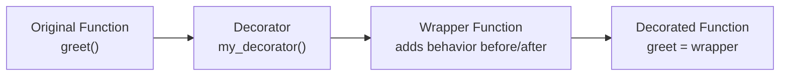
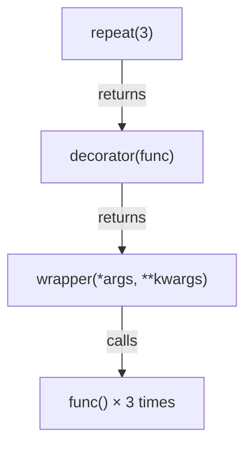
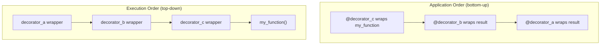

# 09 — Decorators

> **Decorator**: A function (or class) that takes another function as input, wraps it with additional behavior, and returns the modified version — without changing the original function's source code. Decorators implement the **Decorator Pattern** from GoF design patterns.

---

## 1. How Decorators Work



```python
# A decorator is just a function that takes a function and returns a function
def my_decorator(func):
    def wrapper(*args, **kwargs):
        print("Before the function runs")
        result = func(*args, **kwargs)          # call the original
        print("After the function runs")
        return result
    return wrapper

# Manual application:
def greet(name):
    print(f"Hello, {name}!")

greet = my_decorator(greet)   # wrap it manually

# Syntactic sugar with @:
@my_decorator
def greet(name):
    print(f"Hello, {name}!")

# These two are identical
```

---

## 2. Preserving Metadata with `functools.wraps`

> Without `@functools.wraps`, the wrapper replaces the original function's `__name__`, `__doc__`, and `__annotations__`, breaking introspection.

```python
import functools

def my_decorator(func):
    @functools.wraps(func)   # ALWAYS do this — copies metadata from func
    def wrapper(*args, **kwargs):
        return func(*args, **kwargs)
    return wrapper

@my_decorator
def greet(name: str) -> str:
    """Return a greeting."""
    return f"Hello, {name}!"

greet.__name__  # "greet"  (not "wrapper")
greet.__doc__   # "Return a greeting."
```

---

## 3. Decorator with Arguments (Decorator Factory)

> To pass arguments to a decorator, add one more level of nesting. The outer function is a factory that returns the actual decorator.



```python
import functools

def repeat(n: int):
    """Decorator factory: repeat the decorated function n times."""
    def decorator(func):
        @functools.wraps(func)
        def wrapper(*args, **kwargs):
            result = None
            for _ in range(n):
                result = func(*args, **kwargs)
            return result
        return wrapper
    return decorator

@repeat(3)
def say_hello():
    print("Hello!")

say_hello()  # prints "Hello!" three times
```

---

## 4. Practical Decorator Patterns

### Timing / Performance

```python
import time
import functools

def timer(func):
    @functools.wraps(func)
    def wrapper(*args, **kwargs):
        start = time.perf_counter()
        result = func(*args, **kwargs)
        elapsed = time.perf_counter() - start
        print(f"{func.__name__} took {elapsed:.4f}s")
        return result
    return wrapper
```

### Retry on Failure

```python
import functools
import time

def retry(max_attempts: int = 3, delay: float = 1.0, exceptions=(Exception,)):
    def decorator(func):
        @functools.wraps(func)
        def wrapper(*args, **kwargs):
            for attempt in range(1, max_attempts + 1):
                try:
                    return func(*args, **kwargs)
                except exceptions as e:
                    if attempt == max_attempts:
                        raise
                    print(f"Attempt {attempt} failed: {e}. Retrying in {delay}s...")
                    time.sleep(delay)
        return wrapper
    return decorator

@retry(max_attempts=3, delay=0.5, exceptions=(IOError,))
def fetch_data(url: str) -> str:
    ...
```

### Caching / Memoize

```python
# functools.lru_cache is the production-grade version of this
def memoize(func):
    cache = {}
    @functools.wraps(func)
    def wrapper(*args):
        if args not in cache:
            cache[args] = func(*args)
        return cache[args]
    return wrapper
```

### Access Control (Auth Guard Pattern)

```python
def require_admin(func):
    @functools.wraps(func)
    def wrapper(user, *args, **kwargs):
        if not user.is_admin:
            raise PermissionError("Admin access required")
        return func(user, *args, **kwargs)
    return wrapper

@require_admin
def delete_user(user, target_id: int):
    ...
```

---

## 5. Stacking Decorators

> Decorators are applied bottom-up (innermost first). The resulting call executes top-down (outermost wrapper runs first).



```python
@decorator_a
@decorator_b
@decorator_c
def my_function():
    pass

# Equivalent to:
my_function = decorator_a(decorator_b(decorator_c(my_function)))

# Call order: decorator_a → decorator_b → decorator_c → my_function
```

---

## 6. Class-Based Decorators

> When a decorator needs to maintain state between calls, implement it as a class with `__init__` and `__call__`.

```python
import functools

class CountCalls:
    """Decorator that counts how many times a function is called."""
    def __init__(self, func):
        functools.update_wrapper(self, func)   # copies metadata
        self.func = func
        self.count = 0

    def __call__(self, *args, **kwargs):
        self.count += 1
        print(f"{self.func.__name__} called {self.count} time(s)")
        return self.func(*args, **kwargs)

@CountCalls
def greet(name: str) -> str:
    return f"Hello, {name}!"

greet("Alice")  # "greet called 1 time(s)"
greet("Bob")    # "greet called 2 time(s)"
greet.count     # 2
```

---

## 7. Decorating Classes

```python
def add_repr(cls):
    """Add a generic __repr__ to any class."""
    def __repr__(self):
        attrs = ", ".join(f"{k}={v!r}" for k, v in self.__dict__.items())
        return f"{cls.__name__}({attrs})"
    cls.__repr__ = __repr__
    return cls

@add_repr
class Point:
    def __init__(self, x, y):
        self.x = x
        self.y = y

repr(Point(1, 2))  # "Point(x=1, y=2)"
```
