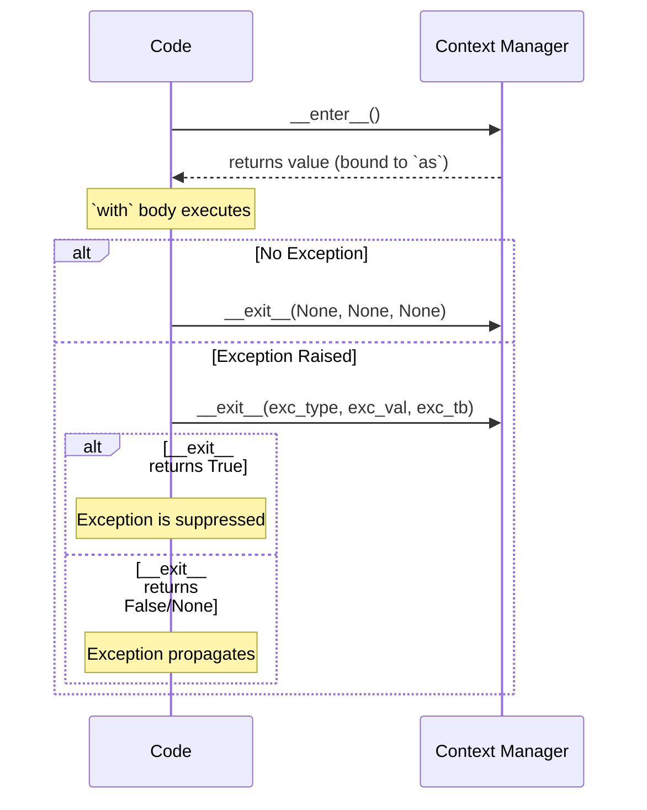
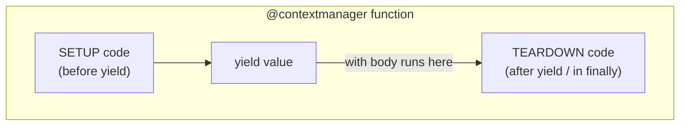
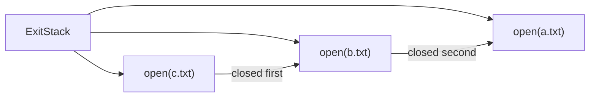

# 10 — Context Managers (In Depth)

> **Context Manager**: An object that defines setup and teardown actions for a block of code. It guarantees that resources (files, connections, locks) are properly acquired and released, even when exceptions occur.

> **Note**: Basic file I/O usage is covered in [07_file_io.md](./07_file_io.md). This file covers the protocol, advanced patterns, and custom implementations.

---

## 1. The `with` Statement Lifecycle



---

## 2. The `__enter__` / `__exit__` Protocol

```python
class DatabaseConnection:
    def __init__(self, url: str) -> None:
        self.url = url
        self.connection = None

    def __enter__(self):
        print(f"Connecting to {self.url}")
        self.connection = connect(self.url)
        return self.connection   # value bound to `as` variable

    def __exit__(self, exc_type, exc_val, exc_tb):
        """
        exc_type: exception class (None if no exception)
        exc_val:  exception instance
        exc_tb:   traceback object

        Return True to suppress the exception.
        Return False/None to propagate it.
        """
        print("Closing connection")
        if self.connection:
            self.connection.close()

        if exc_type is not None:
            print(f"Exception occurred: {exc_val}")
        return False  # do not suppress exceptions


with DatabaseConnection("postgresql://localhost/mydb") as conn:
    conn.execute("SELECT 1")
```

---

## 3. `contextlib.contextmanager`

> The cleanest way to write a simple context manager. The `yield` statement splits the function into setup (before yield) and teardown (after yield).



```python
from contextlib import contextmanager

@contextmanager
def transaction(session):
    """Wrap a database session in a transaction."""
    try:
        yield session       # body of `with` block runs here
        session.commit()
    except Exception:
        session.rollback()
        raise               # re-raise so the caller sees the error
```

---

## 4. `contextlib.asynccontextmanager`

> For async context managers using `async with`.

```python
from contextlib import asynccontextmanager

@asynccontextmanager
async def managed_session(session_factory):
    session = session_factory()
    try:
        yield session
        await session.commit()
    except Exception:
        await session.rollback()
        raise
    finally:
        await session.close()

async with managed_session(factory) as session:
    await session.execute(...)
```

---

## 5. `contextlib.ExitStack`

> Manages a dynamic number of context managers. Useful when you don't know at compile time how many resources to open. Cleanup happens in LIFO (reverse) order.



```python
from contextlib import ExitStack

def process_files(filenames: list[str]) -> None:
    with ExitStack() as stack:
        files = [stack.enter_context(open(f)) for f in filenames]
        # All files opened; all will be closed when block exits
        for f in files:
            print(f.read())

# You can also register arbitrary cleanup callbacks
with ExitStack() as stack:
    stack.callback(print, "Cleanup 1")   # called on exit
    stack.callback(print, "Cleanup 2")   # called on exit (reverse order)
    print("Doing work")
# Output:
# Doing work
# Cleanup 2
# Cleanup 1
```

---

## 6. `contextlib.suppress`

> Replaces a `try/except/pass` block for intentionally ignored exceptions.

```python
from contextlib import suppress
import os

# Instead of:
try:
    os.remove("temp.txt")
except FileNotFoundError:
    pass

# Use:
with suppress(FileNotFoundError):
    os.remove("temp.txt")

# Multiple exception types
with suppress(FileNotFoundError, PermissionError):
    os.remove("protected.txt")
```

---

## 7. `contextlib.redirect_stdout`

```python
from contextlib import redirect_stdout
import io

output = io.StringIO()
with redirect_stdout(output):
    print("This goes to the buffer, not the terminal")

captured = output.getvalue()  # "This goes to the buffer, not the terminal\n"
```

---

## 8. Nested Context Managers

```python
# These are equivalent:

# Single `with` with multiple managers (Python 3.10+ can use parentheses)
with (
    open("input.txt") as infile,
    open("output.txt", "w") as outfile,
):
    outfile.write(infile.read())

# Nested `with` statements
with open("input.txt") as infile:
    with open("output.txt", "w") as outfile:
        outfile.write(infile.read())
```
