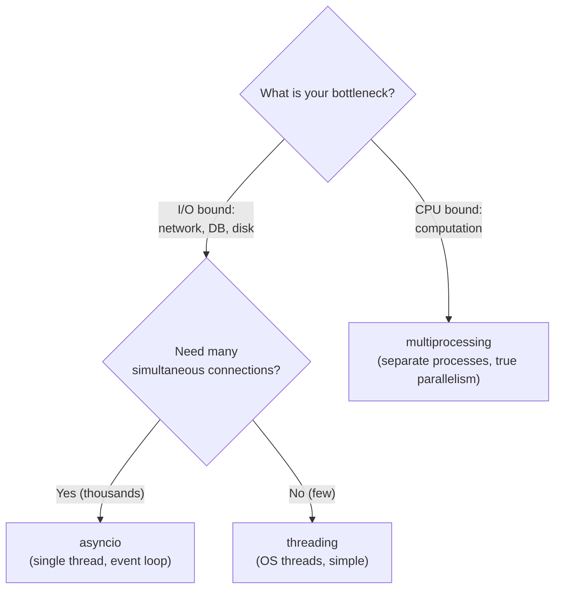
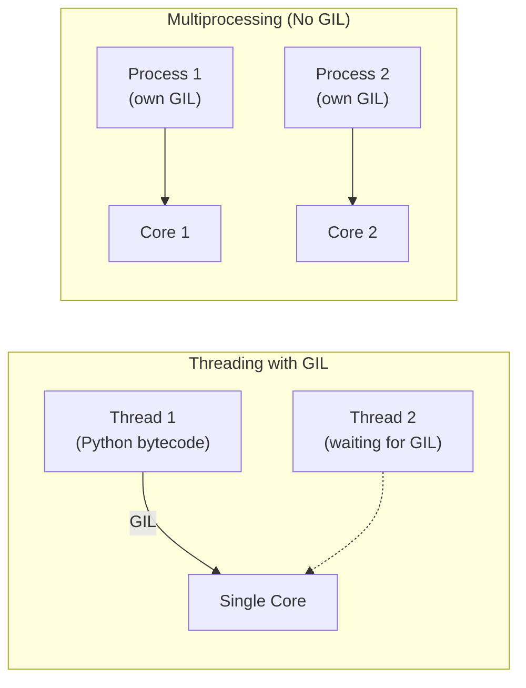
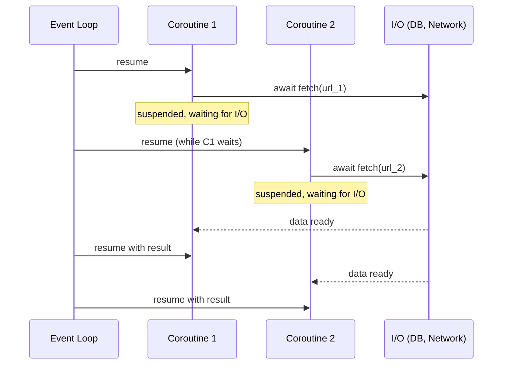

# 11 — Concurrency

> **Concurrency**: Multiple tasks making progress within overlapping time periods. Tasks may not run simultaneously — they interleave execution.
>
> **Parallelism**: Multiple tasks running at the exact same time on different CPU cores. A subset of concurrency.

Python offers three concurrency models. Choosing the right one depends on whether your bottleneck is I/O or CPU.



---

## 1. The GIL (Global Interpreter Lock)

> **GIL**: A mutex in CPython that allows only one thread to execute Python bytecode at any given time. This prevents race conditions in CPython's memory management but limits true parallelism for CPU-bound code.



**Implications**:

- **I/O-bound tasks**: Threads are effective. The GIL is released while waiting for I/O (network, disk), so other threads can run.
- **CPU-bound tasks**: Threads do NOT help — they're limited by the GIL. Use `multiprocessing` instead, which spawns separate processes each with their own GIL.

---

## 2. `threading` — OS Threads

> **Thread**: A lightweight unit of execution that shares memory with other threads in the same process. Best for I/O-bound tasks and simple parallelism.

```python
import threading
import time

def download(url: str) -> None:
    print(f"Downloading {url}...")
    time.sleep(1)  # simulate network I/O
    print(f"Done: {url}")

urls = ["https://a.com", "https://b.com", "https://c.com"]

threads = [threading.Thread(target=download, args=(url,)) for url in urls]
for t in threads:
    t.start()
for t in threads:
    t.join()   # wait for all threads to complete

# ThreadPoolExecutor — higher-level, manages a pool of reusable threads
from concurrent.futures import ThreadPoolExecutor

with ThreadPoolExecutor(max_workers=4) as executor:
    futures = [executor.submit(download, url) for url in urls]
    results = [f.result() for f in futures]  # block until all done
```

### Shared State and Locks

> **Lock (Mutex)**: A synchronization primitive that ensures only one thread accesses a critical section at a time. Without locks, concurrent writes to shared state cause race conditions.

```python
import threading

counter = 0
lock = threading.Lock()

def increment():
    global counter
    with lock:        # only one thread enters this block at a time
        counter += 1

threads = [threading.Thread(target=increment) for _ in range(100)]
for t in threads: t.start()
for t in threads: t.join()
print(counter)  # 100 (safe with lock)
```

---

## 3. `multiprocessing` — OS Processes

> **Process**: A fully independent execution unit with its own memory space and GIL. Processes achieve true parallelism on multi-core CPUs but have higher overhead than threads (memory duplication, IPC serialization).

```python
import multiprocessing

def cpu_heavy(n: int) -> int:
    return sum(i**2 for i in range(n))

# ProcessPoolExecutor — high-level process pool
from concurrent.futures import ProcessPoolExecutor

with ProcessPoolExecutor(max_workers=4) as executor:
    results = list(executor.map(cpu_heavy, [10**6, 10**6, 10**6]))
    print(results)

# Important: code using ProcessPoolExecutor must be in if __name__ == "__main__"
if __name__ == "__main__":
    with ProcessPoolExecutor() as pool:
        pool.map(cpu_heavy, [10**6] * 4)
```

---

## 4. `asyncio` — Cooperative Concurrency

> **Coroutine**: A function defined with `async def` whose execution can be suspended (at `await` points) and resumed later. Coroutines cooperatively yield control to the event loop, allowing other coroutines to run.
>
> **Event Loop**: The central scheduler that manages and runs coroutines. It monitors I/O readiness and decides which coroutine to resume next.



### Coroutines

```python
import asyncio

async def fetch(url: str) -> str:
    """An async function is called a coroutine."""
    await asyncio.sleep(1)   # yields control to the event loop while waiting
    return f"Response from {url}"

# Run a single coroutine
result = asyncio.run(fetch("https://example.com"))
```

### Running Multiple Coroutines Concurrently

```python
async def main():
    # Sequential (slow): one at a time
    r1 = await fetch("https://a.com")
    r2 = await fetch("https://b.com")

    # Concurrent (fast): all at once, total time = max(individual times)
    r1, r2, r3 = await asyncio.gather(
        fetch("https://a.com"),
        fetch("https://b.com"),
        fetch("https://c.com"),
    )
    return [r1, r2, r3]

asyncio.run(main())
```

### Sequential vs Concurrent Execution

```mermaid
gantt
    title Sequential vs Concurrent Execution
    dateFormat  X
    axisFormat  %s

    section Sequential
    fetch(a.com) :a1, 0, 1
    fetch(b.com) :a2, 1, 2
    fetch(c.com) :a3, 2, 3

    section Concurrent (gather)
    fetch(a.com) :b1, 0, 1
    fetch(b.com) :b2, 0, 1
    fetch(c.com) :b3, 0, 1
```



### `asyncio.gather` vs `asyncio.TaskGroup` (Python 3.11+)

```python
# TaskGroup is preferred in 3.11+ — cleaner error handling
async def main():
    async with asyncio.TaskGroup() as tg:
        task1 = tg.create_task(fetch("https://a.com"))
        task2 = tg.create_task(fetch("https://b.com"))
    # All tasks finished here
    print(task1.result(), task2.result())
```

### Timeouts

```python
async def main():
    try:
        result = await asyncio.wait_for(fetch("https://slow.com"), timeout=2.0)
    except asyncio.TimeoutError:
        print("Request timed out!")
```

### async for / async with

```python
async def async_generator():
    for i in range(5):
        await asyncio.sleep(0.1)
        yield i

async def main():
    async for value in async_generator():
        print(value)

    async with some_async_context_manager() as resource:
        await resource.do_something()
```

---

## 5. Concurrency Model Comparison

| Model | Best For | Parallelism | GIL Impact | Memory | Complexity |
|-------|----------|-------------|-----------|--------|------------|
| `threading` | I/O-bound, simple cases | Limited by GIL | Yes | Shared | Low |
| `multiprocessing` | CPU-bound | True parallel | Bypassed | Separate | Medium |
| `asyncio` | High-throughput I/O | Cooperative (1 thread) | N/A | Shared | Medium |

### Key Rules

- **Never block the asyncio event loop**: Avoid `time.sleep()`, heavy computation, or synchronous I/O inside `async def`. Use `await asyncio.sleep()` or `asyncio.to_thread()`.
- **`asyncio.to_thread()`**: Run a blocking function in a thread without blocking the event loop:

```python
import asyncio

def blocking_db_call():
    import time
    time.sleep(1)   # simulates a slow synchronous library
    return "result"

async def main():
    result = await asyncio.to_thread(blocking_db_call)
    print(result)
```
