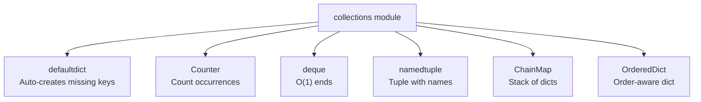
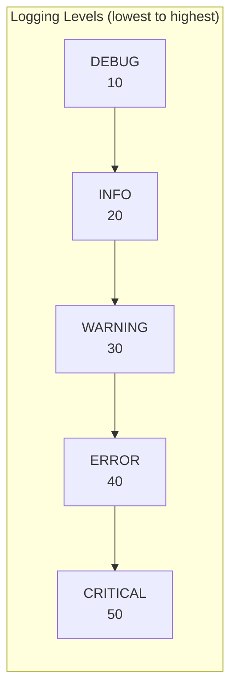
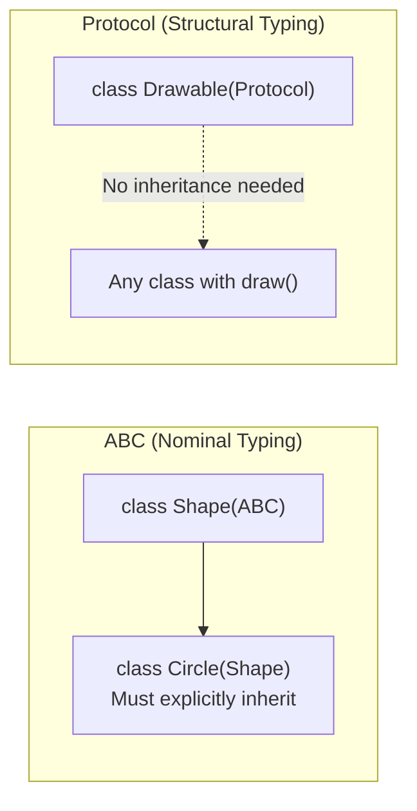

# 12 — Standard Library Essentials

---

## 1. `collections` — Specialized Data Structures

> Python's `collections` module provides high-performance container alternatives beyond the built-in `list`, `dict`, and `set`.



```python
from collections import (
    defaultdict, Counter, deque, OrderedDict, namedtuple, ChainMap
)

# defaultdict: auto-creates missing keys with a factory function
word_count = defaultdict(int)      # missing key → int() → 0
for word in "the quick brown fox the fox".split():
    word_count[word] += 1
# {"the": 2, "quick": 1, "brown": 1, "fox": 2}

# Counter: count occurrences in an iterable
from collections import Counter
c = Counter("abracadabra")
# Counter({'a': 5, 'b': 2, 'r': 2, 'c': 1, 'd': 1})
c.most_common(2)     # [('a', 5), ('b', 2)]
c["a"]               # 5
c["z"]               # 0 (not KeyError!)
c1 = Counter(a=3, b=1)
c2 = Counter(a=1, b=2)
c1 + c2              # Counter({'a': 4, 'b': 3})

# deque: O(1) appends and pops from both ends
q = deque([1, 2, 3], maxlen=5)
q.appendleft(0)    # [0, 1, 2, 3]
q.popleft()        # removes 0; O(1) vs list's O(n) pop(0)
q.rotate(1)        # rotate right by 1

# namedtuple: tuple with named fields
Point = namedtuple("Point", ["x", "y"])
p = Point(3, 4)
p.x    # 3
p._asdict()   # {"x": 3, "y": 4}

# ChainMap: combine multiple dicts (first match wins)
defaults = {"color": "blue", "size": "M"}
overrides = {"color": "red"}
config = ChainMap(overrides, defaults)
config["color"]   # "red" (from overrides)
config["size"]    # "M"   (from defaults)
```

---

## 2. `datetime` — Dates and Times

> **Naive datetime**: Has no timezone info. Ambiguous — you cannot tell what instant in time it represents.
>
> **Aware datetime**: Has timezone info attached. Unambiguous. Always use aware datetimes in production.

```python
from datetime import datetime, date, timedelta, timezone

# Current time
now = datetime.now()              # local time (naive — no timezone info)
utc_now = datetime.now(timezone.utc)  # UTC-aware (recommended)

# Creating datetimes
dt = datetime(2024, 6, 15, 12, 30, 0)
d = date(2024, 6, 15)

# Formatting and Parsing
dt.strftime("%Y-%m-%d %H:%M:%S")    # "2024-06-15 12:30:00"
datetime.strptime("2024-06-15", "%Y-%m-%d")

# ISO 8601 (use for APIs and storage)
dt.isoformat()                   # "2024-06-15T12:30:00"
datetime.fromisoformat("2024-06-15T12:30:00")

# Arithmetic with timedelta
tomorrow = date.today() + timedelta(days=1)
one_hour_ago = utc_now - timedelta(hours=1)
duration = datetime(2024, 6, 15) - datetime(2024, 6, 10)
duration.days  # 5

# Timezone handling (use pytz or zoneinfo for named timezones)
from zoneinfo import ZoneInfo    # Python 3.9+
ist = datetime.now(ZoneInfo("Asia/Kolkata"))
```

---

## 3. `os` and `os.path`

```python
import os

os.getcwd()            # current working directory
os.listdir(".")        # list directory contents
os.makedirs("a/b/c", exist_ok=True)  # recursive mkdir
os.remove("file.txt")
os.rename("old.txt", "new.txt")
os.environ.get("DATABASE_URL", "default")  # read env var safely

# Prefer pathlib for new code (see 07_file_io.md)
```

---

## 4. `json` — JSON Serialization

> **Serialization**: Converting a Python object to a JSON string (`dumps`) or file (`dump`).
>
> **Deserialization**: Converting a JSON string (`loads`) or file (`load`) back to a Python object.

```python
import json

# Python object → JSON string
data = {"name": "Alex", "scores": [95, 87]}
json_str = json.dumps(data, indent=2, sort_keys=True)

# JSON string → Python object
parsed = json.loads(json_str)

# File I/O
with open("data.json", "w") as f:
    json.dump(data, f, indent=2)

with open("data.json") as f:
    data = json.load(f)

# Custom serialization for non-JSON types
from datetime import datetime

class DateTimeEncoder(json.JSONEncoder):
    def default(self, obj):
        if isinstance(obj, datetime):
            return obj.isoformat()
        return super().default(obj)

json.dumps({"created_at": datetime.now()}, cls=DateTimeEncoder)
```

---

## 5. `re` — Regular Expressions

> **Regex**: A pattern language for matching text. `re.search` finds the first match anywhere; `re.match` matches only at the start; `re.findall` returns all matches.

```python
import re

text = "Order #12345 placed on 2024-06-15"

# Search: find first match anywhere in string
match = re.search(r"\d{4}-\d{2}-\d{2}", text)
if match:
    print(match.group())   # "2024-06-15"

# Match: only matches at the START of the string
re.match(r"Order", text)   # Match object
re.match(r"\d+", text)     # None (doesn't start with digits)

# Find all matches
re.findall(r"\d+", text)   # ["12345", "2024", "06", "15"]

# Substitution
re.sub(r"\d+", "X", text)  # "Order #X placed on X-X-X"

# Compiled patterns (for repeated use — better performance)
pattern = re.compile(r"(?P<year>\d{4})-(?P<month>\d{2})-(?P<day>\d{2})")
m = pattern.search(text)
m.group("year")    # "2024"
m.group("month")   # "06"
```

---

## 6. `logging` — Structured Logging

> **Logging**: Use `logging` over `print()` for production code. Loggers support levels, formatting, handlers (file, console, network), and can be enabled/disabled per-module.



```python
import logging

# Basic setup (configure once at application entry point)
logging.basicConfig(
    level=logging.INFO,
    format="%(asctime)s [%(levelname)s] %(name)s: %(message)s"
)

# Use __name__ for module-level loggers
logger = logging.getLogger(__name__)

logger.debug("Debug detail (only shown if level=DEBUG)")
logger.info("Server started on port %d", 8080)      # use % formatting (lazy)
logger.warning("High memory usage: %s%%", 90)
logger.error("Failed to connect to database")
logger.exception("Uncaught exception:")             # logs traceback automatically
```

---

## 7. `typing` — Advanced Types

> These advanced typing constructs are essential for building well-typed, maintainable codebases.

```python
from typing import TypedDict, Protocol, Literal, TypeAlias

# TypedDict: for dict shapes (useful with JSON)
class UserDict(TypedDict):
    id: int
    name: str
    email: str

# Protocol: structural subtyping ("duck typing" with types)
class Drawable(Protocol):
    def draw(self) -> None: ...

# Any class with a draw() method satisfies Drawable — no inheritance needed
class Circle:
    def draw(self) -> None:
        print("Drawing circle")

def render(shape: Drawable) -> None:
    shape.draw()

render(Circle())  # ✅ works

# Literal: restrict to specific values
Direction = Literal["north", "south", "east", "west"]

def move(direction: Direction) -> None: ...

move("north")    # ✅
move("up")       # ❌ type checker error

# TypeAlias (Python 3.10+)
Vector: TypeAlias = list[float]
```

### Protocol vs ABC



---

## 8. `functools` Quick Reference

| Function | Purpose |
|----------|---------|
| `partial(fn, *args)` | Pre-fill some arguments |
| `reduce(fn, iterable)` | Fold sequence to single value |
| `lru_cache(maxsize)` | Memoization decorator |
| `cache` | Unbounded memoization (3.9+) |
| `wraps(fn)` | Preserve metadata in decorators |
| `total_ordering` | Define `__eq__` + one compare → gets all |

---

## 9. `pathlib` Quick Reference

```python
from pathlib import Path

Path.cwd()                  # current directory
Path.home()                 # home directory
Path("a") / "b" / "c.txt"  # path joining with /
p.exists() / p.is_file() / p.is_dir()
p.read_text() / p.write_text()
p.mkdir(parents=True, exist_ok=True)
p.glob("**/*.py")           # recursive glob
p.stat().st_size            # file size in bytes
p.suffix / p.stem / p.name / p.parent
```
