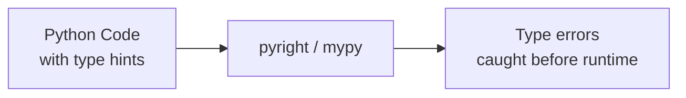
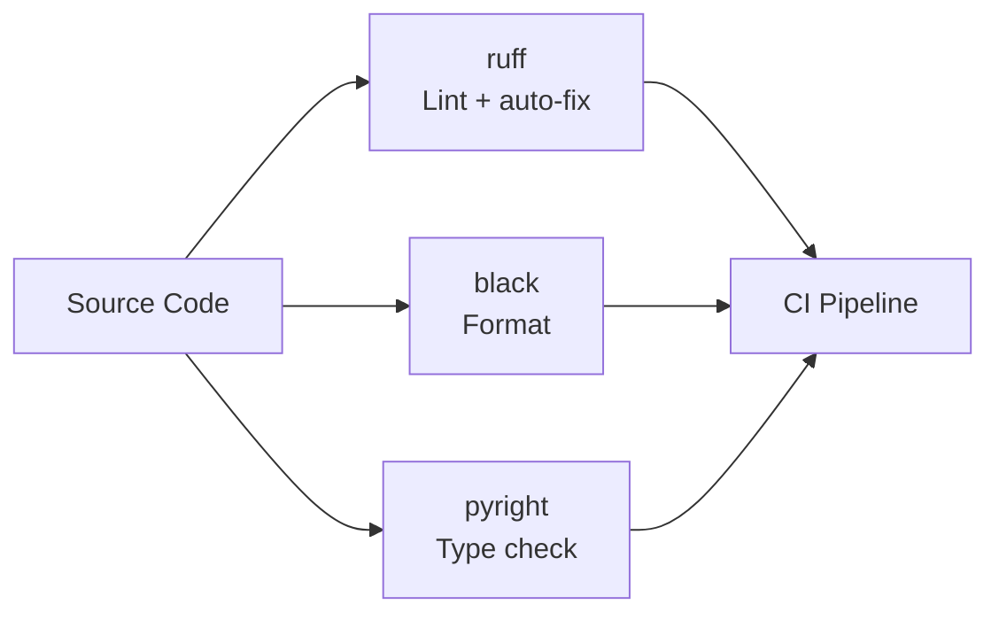
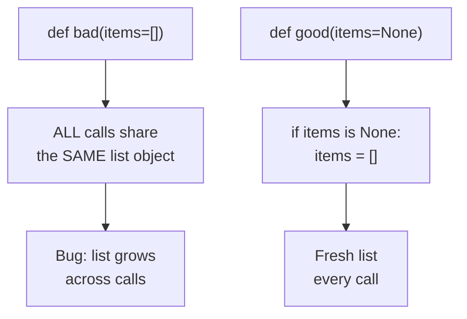
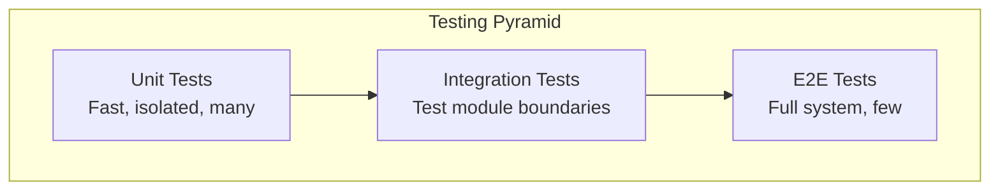

# 13 — Best Practices & Production Patterns

---

## 1. PEP 8 Essentials

> **PEP 8**: Python's official style guide. Consistency within a project is more important than strict adherence to any single rule.

| Rule | Guideline |
|------|-----------|
| Indentation | 4 spaces (no tabs) |
| Line length | 88–120 chars (Black uses 88 by default) |
| Naming: variables/functions | `snake_case` |
| Naming: classes | `PascalCase` |
| Naming: constants | `UPPER_SNAKE_CASE` |
| Naming: "private" | Leading underscore `_private` |
| Naming: name-mangled | Double underscore `__mangled` |
| Blank lines | 2 between top-level, 1 between methods |
| Imports | One per line; stdlib, then third-party, then local |

### Import Ordering

```python
# 1. Standard library
import os
import sys
from pathlib import Path

# 2. Third-party
import fastapi
from sqlalchemy.ext.asyncio import AsyncSession

# 3. Local application
from src.modules.users.service import UserService
```

---

## 2. Type Hints

> **Type Hints**: Not enforced at runtime. They serve as machine-verifiable documentation and enable static analysis tools to catch bugs before execution.



```python
# ✅ DO annotate function signatures
def create_user(name: str, email: str, age: int = 0) -> "User":
    ...

# ✅ DO use | None for optional (Python 3.10+)
def get_user(user_id: int) -> User | None:
    ...

# ✅ DO use TypeAlias for complex types
from typing import TypeAlias
UserId: TypeAlias = int
UserMap: TypeAlias = dict[UserId, User]

# ✅ DO use Protocol for duck typing interfaces
from typing import Protocol

class Repository(Protocol):
    def find_by_id(self, id: int) -> object | None: ...
    def save(self, entity: object) -> None: ...
```

---

## 3. Code Quality Tools



| Tool | Purpose | Command |
|------|---------|---------|
| **ruff** | Lint + auto-fix (replaces flake8, isort) | `ruff check . --fix` |
| **black** | Code formatter | `black .` |
| **pyright / mypy** | Static type checking | `pyright src/` |
| **pre-commit** | Run checks automatically before git commit | `pre-commit run --all-files` |

---

## 4. Docstrings

> **PEP 257**: Docstrings use triple quotes and imperative mood. They describe *what* the function does, not *how*.

```python
def get_user_by_id(user_id: int) -> User | None:
    """Retrieve a user by their unique identifier.

    Args:
        user_id: The unique integer identifier of the user.

    Returns:
        The User entity if found, or None if not found.

    Raises:
        DatabaseError: If a database connection error occurs.
    """
    ...
```

---

## 5. Avoiding Common Pitfalls

### Mutable Default Arguments



```python
# ❌ WRONG: the list is created once and shared between all calls
def bad_append(item, result=[]):
    result.append(item)
    return result

# ✅ CORRECT:
def good_append(item, result=None):
    if result is None:
        result = []
    result.append(item)
    return result
```

### Catching Too Broadly

```python
# ❌ WRONG: hides real bugs
try:
    do_something()
except:
    pass

# ✅ CORRECT: catch specific exceptions and handle/log them
try:
    do_something()
except ValueError as e:
    logger.warning("Invalid value: %s", e)
```

### Late Binding in Closures

```python
# ❌ WRONG: all functions capture the same `i` variable at call time
fns = [lambda: i for i in range(3)]
fns[0]()  # 2, not 0!

# ✅ CORRECT: capture the value early with a default argument
fns = [lambda i=i: i for i in range(3)]
fns[0]()  # 0
```

### String Concatenation in Loops

```python
# ❌ WRONG: O(n²) — creates a new string on every iteration
result = ""
for item in items:
    result += str(item)

# ✅ CORRECT: O(n) — join at the end
result = "".join(str(item) for item in items)
```

---

## 6. Testing Best Practices



```python
# Use pytest — the de facto standard
# File: tests/test_users.py

import pytest

# Simple test
def test_user_creation():
    user = User(name="Alex", email="alex@example.com")
    assert user.name == "Alex"

# Parameterized tests
@pytest.mark.parametrize("email, expected", [
    ("alex@example.com", True),
    ("not-an-email", False),
    ("", False),
])
def test_email_validation(email, expected):
    assert validate_email(email) == expected

# Fixtures: reusable setup/teardown
@pytest.fixture
def sample_user() -> User:
    return User(name="Test User", email="test@example.com")

def test_greet(sample_user):
    assert sample_user.greet() == "Hi, I'm Test User"

# Async tests
@pytest.mark.asyncio
async def test_async_operation():
    result = await some_async_function()
    assert result is not None

# Mocking external dependencies
from unittest.mock import AsyncMock, MagicMock, patch

def test_service_calls_repo(sample_user):
    repo = MagicMock()
    repo.find_by_id.return_value = sample_user

    service = UserService(repo=repo)
    result = service.get_user(1)

    repo.find_by_id.assert_called_once_with(1)
    assert result == sample_user
```

---

## 7. Project Structure

```
project/
├── src/
│   ├── main.py              # app entry point
│   ├── core/                # config, middleware, lifecycle
│   ├── modules/             # vertical feature slices
│   │   └── users/
│   │       ├── router.py
│   │       ├── service.py
│   │       ├── repository.py
│   │       ├── entities.py
│   │       ├── models.py
│   │       ├── schemas.py
│   │       └── exceptions.py
│   ├── shared/              # cross-cutting utilities
│   └── db/                  # database setup
├── tests/
│   └── modules/
│       └── users/
├── alembic/                 # migrations
├── pyproject.toml           # dependencies + tool config
└── README.md
```

---

## 8. Dependency Management

> **`pyproject.toml`**: The modern standard for Python project metadata and dependency declaration (replaces `setup.py` and `requirements.txt`).

```toml
# pyproject.toml
[project]
name = "my-app"
version = "0.1.0"
requires-python = ">=3.11"
dependencies = [
    "fastapi>=0.110",
    "sqlalchemy>=2.0",
    "pydantic>=2.0",
]

[project.optional-dependencies]
dev = [
    "pytest>=8.0",
    "ruff>=0.4",
    "pyright>=1.1",
]
```

Use `uv` (fast) or `pip` with `pip-tools` for dependency pinning.

---

## 9. Python Idioms Cheat Sheet

```python
# Swap variables
a, b = b, a

# Unpack with *
first, *rest = [1, 2, 3, 4, 5]
*init, last = [1, 2, 3, 4, 5]
first, *middle, last = [1, 2, 3, 4, 5]

# Conditional assignment
value = config.get("key") or "default"

# Safe dict access
user = users.get(user_id)   # returns None if not found (no KeyError)

# Flatten one level
flat = [item for sublist in nested for item in sublist]

# Readable large numbers
million = 1_000_000

# Dict merging (Python 3.9+)
merged = {**dict1, **dict2}   # or: dict1 | dict2

# Null coalescing pattern
result = value if value is not None else default
```
